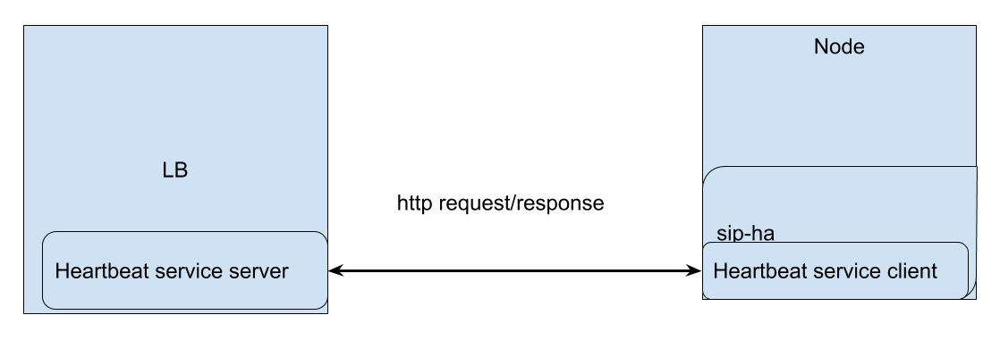
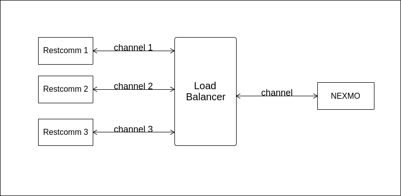
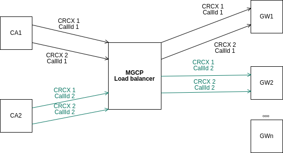
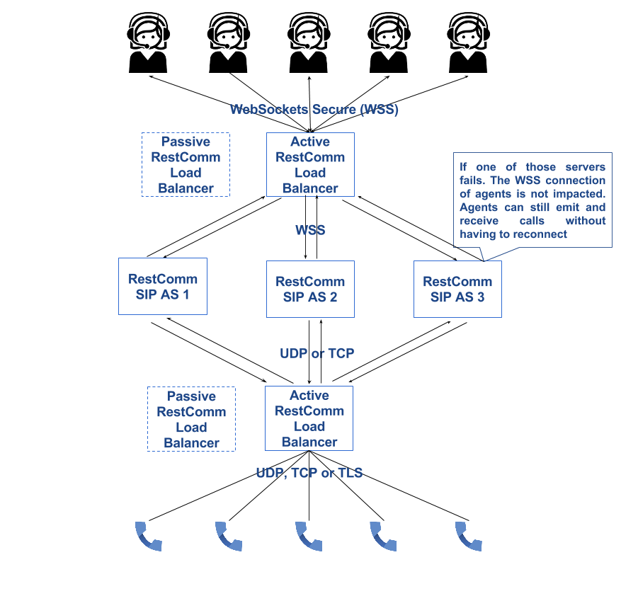
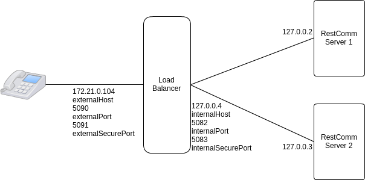
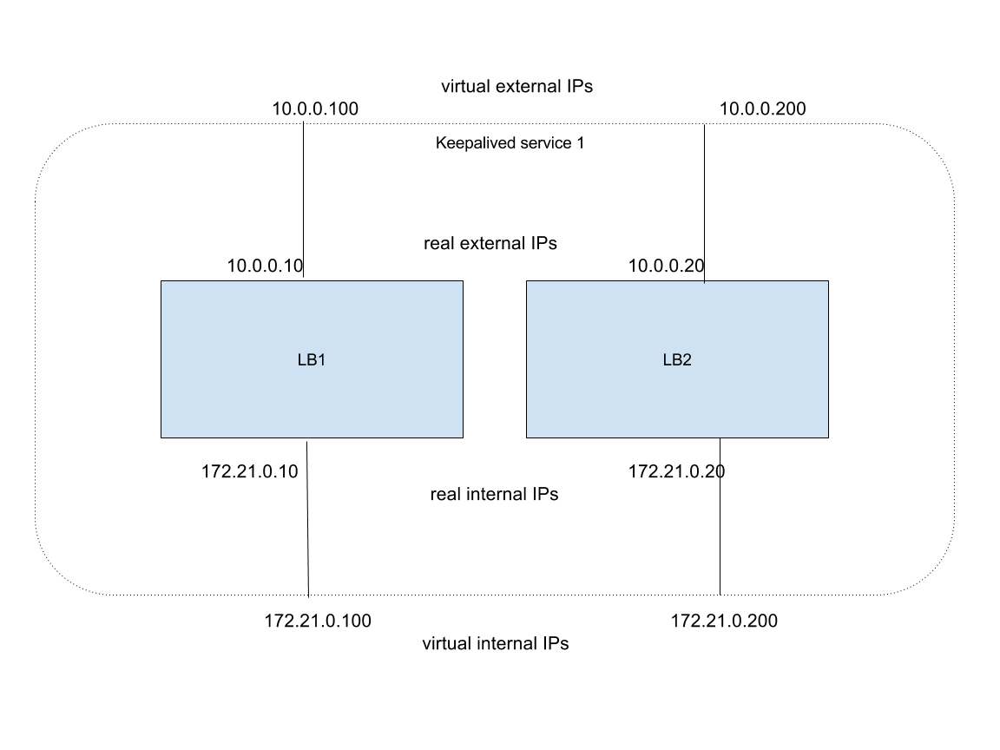

[[_sslb_mss_load_balancer]]
= Load Balancer

.Star Cluster Topology.
image::images/mss-MSSSIPLoadBalancer-dia-StarNetworkTopology.jpg[]

The {this-platform} Load Balancer is used to balance the load of SIP service requests and responses between nodes in a SIP Server cluster, such as {this-platform} JAIN SLEE or SIP Servlets.
Both {this-platform} servers can be used in conjunction with the {this-platform} Load Balancer to increase the performance and availability of SIP services and applications.

In terms of functionality, the {this-platform} Load Balancer is a simple stateless proxy server that intelligently forwards SIP session requests and responses between User Agents (UAs) on a Wide Area Network (WAN), and SIP Server nodes, which are almost always located on a Local Area Network (LAN). All SIP requests and responses pass through the {this-platform} Load Balancer.

Starting with the 2.0.0.GA release, {this-platform} Load Balancer can handle WebSocket requests supporting up to version 13 of the wire protocol - RFC 6455 (version 17 of the draft hybi specification - http://tools.ietf.org/html/draft-ietf-hybi-thewebsocketprotocol-17  ). {this-platform} Load Balancer will accept HTTP requests and if the request contains header Sec-WebSocket-Protocol it will upgrade the connection and dispatch the reuqest to a node capable to handle WebSocket requests (a node that has a WebSocket connector).

One major advantage of having WebSocket support for {this-platform} Load Balancer is to allow tunneling over HTTP port for SIP traffic and thus bypass proxy and firewall servers that might be blocking SIP traffic.

[[_sslb_sip_load_balancing_basics]]
== SIP Load Balancing Basics

All User Agents send SIP messages, such as `INVITE` and `MESSAGE`, to the same SIP URI (the IP address and port number of the {this-platform} Load Balancer on the WAN). The Load Balancer then parses, alters, and forwards those messages to an available node in the cluster.
If the message was sent as a part of an existing SIP session, it will be forwarded to the cluster node which processed that User Agent's original transaction request.

The SIP Server that receives the message acts upon it and sends a response back to the {this-platform} Load Balancer.
The {this-platform} Load Balancer reparses, alters and forwards the message back to the original User Agent.
This entire proxying and provisioning process is carried out independent of the User Agent, which is only concerned with the SIP service or application it is using.

By using the Load Balancer, SIP traffic is balanced across a pool of available SIP Servers, increasing the overall throughput of the SIP service or application running on either individual nodes of the cluster.
In the case of a {this-platform} server with `</distributed>` capabilities, load balancing advantages are applied across the entire cluster.

The {this-platform} Load Balancer is also able to failover requests mid-call from unavailable nodes to available ones, thus increasing the reliability of the SIP service or application.
The Load Balancer increases throughput and reliability by dynamically provisioning SIP service requests and responses across responsive nodes in a cluster.
This enables SIP applications to meet the real-time demand for SIP services.

[[_sslb_load_balancer_node_discovery]]
=== Node Discovery of the {this-platform} Load Balancer

Each individual {this-platform} SIP Server in the cluster is responsible for
contacting the {this-platform} Load Balancer and relaying its health status and
regular "heartbeats" except case with <<Kubernetes integration>>.

From these health status reports and heartbeats, the {this-platform} Load Balancer creates and maintains a list of all available and healthy nodes in the cluster allowing for making the whole cluster dynamic and capable of autoscaling with no downtime.

The Load Balancer forwards SIP requests between these cluster nodes, providing that the provisioning algorithm reports that each node is healthy and is still sending heartbeats.

If an abnormality is detected, the {this-platform} Load Balancer removes the unhealthy or unresponsive node from the list of available nodes.
In addition, mid-session and mid-call messages are failed over to a healthy node.

The {this-platform} Load Balancer first receives SIP requests from endpoints on a port that is specified in its Configuration Properties configuration file.
The {this-platform} Load Balancer, using a round-robin algorithm, then selects a node to which it forwards the SIP requests.
The Load Balancer forwards all same-session requests to the first node selected to initiate the session, providing that the node is healthy and available.

[[_sslb_load_balancer_keepalive]]
=== Heartbeats to the {this-platform} Load Balancer

Currently the Load balancer support three protocols for heartbeats(RMI, protocol
based on http requests, and protocol for Kubernetes(explained in )).
For RMI you should set:

<heartbeat configclass = "org.mobicents.tools.heartbeat.rmi.HeartbeatConfigRmi">
  <heartbeatConfig>
    <ProtocolClassName>org.mobicents.tools.heartbeat.rmi.ServerControllerRmi</ProtocolClassName>
      <rmiRegistryPort>2000</rmiRegistryPort>
      <rmiRemoteObjectPort>2001</rmiRemoteObjectPort>
  </heartbeatConfig>
</heartbeat>

For http protocol:

 <heartbeat configclass = "org.mobicents.tools.heartbeat.impl.HeartbeatConfigHttp">
   <heartbeatConfig>
     <ProtocolClassName>org.mobicents.tools.heartbeat.impl.ServerController</ProtocolClassName>
       <heartbeatPort>2610</heartbeatPort>
   </heartbeatConfig>
</heartbeat>
.

For RMI protocol you should set:

  org.mobicents.tools.heartbeat.rmi.ServerControllerRmi

For protocol based on http requests:

  org.mobicents.tools.heartbeat.impl.ServerController

Heartbeats service based on http protocol. Each http request and response has JSON
object with required data. The load balancer and SIP-HA listens on heartbeats
ports which we should set in configuration. Also for SIP-HA we should set port
of the load balancer on which SIP-HA will send requests.

.Heartbeat protocol

Protocol has next requests:

 * Node’s start request

After Node’s start sip-ha will send start POST http request with JSON object
with info about Node (hostname, ip, ports, sessionId etc.). sessionId generates
after Restcomm’s start or restart. The Node sends periodically start request
until getting http start response from the Load balancer.

 * Node’s heartbeat request

After getting start http response, RC will send heartbeat requests
This request will have JSON object with only sessionId value. On each heartbeat
request the Load balancer sends heartbeat http response.

For signalising about gracefully shutdown the Node can send the shutdown request
to the Load balancer

 * Node’s shutdown request

If node will shutdown then it will send shutdown request. If we don’t need
gracefully shutdown but need just stop the Node then the Node can use stop request.
For signaling about stopping of the Load balancer, it can send stop http request
to the Node.

  * LB’s stop request:

When the Node gets stop request from the Load balancer,
it will start send the start request to the Load balancer until will not get
start response.

=== Additional health check of the Nodes by the {this-platform} Load Balancer

Sometimes we face the situation when the server goes down but LB considers
it is alive since ping packets are sent in the normal way.
This problem arises because the processing of keep alive and SIP messages
takes place on different levels and even if SIP is not responding, the ping
packets still can be sent. On client side this situation looks as follows:
a client sends messages to LB, LB forwards the messages to the dead server
and no response is received. In such way a client tries and fails to
connect to the server, because LB is not aware that the server is dead.
The snag is that it is not possible to identify this issue via keep alive since
the keep alive message flow is not interrupted in this case.

So we need to identify the dead server by its ability to process the messages.
It implemented by recording the number of requests (which remain without any
response) and storing the timestamp of last packet sent by server. If maxRequestNumberWithoutResponse
and maxResponseTime values are exceeded then LB removes the node.
It is important to note that the node is considered dead only when both
these values are exceeded. If only one value is exceeded, the node is
still considered as alive. By monitoring these two values we can insure
that LB does not send any packets to the dead server while we do not remove
the node which is active but coincidentally exceeded maxResponseTime or
 maxRequestNumberWithoutResponse. Below you can find more details on how it works.

Counter stores the number of requests which were sent to the server till the
server response was received. When LB sends request to the server – the
counter increments by one. As soon as LB receives any packet from the server –
the counter sets to zero. The “maxRequestNumberWithoutResponse” is a configurable
value. If maxRequestNumberWithoutResponse without response is exceeded but the
server response does not take too long (it keeps within maxResponseTime limits),
the node is still considered active. The “maxResponseTime” parameter also configurable.
The maxResponseTime will allow to identify the server which fails to respond
within specific time frame. The timestamp of last packet sent by server is
stored and if the server response takes too long (the maxResponseTime value is
exceeded) but the number of requests without response is small, then LB considers
the server is active. In case both maxResponseTime and maxRequestNumberWithoutResponse
are exceeded, LB considers the server is dead and stops sending messages to the server.

=== {this-platform} Load Balancer supports SIP Over Websockets

The websocket client (e.g. RestcommONE Olympus) can connect to Load balancer
on port which should be set in lb-configuration.properties externalWsPort and
internal.wsPort if needed. To work with secure websocket it is necessary to set
external.wssPort and internal.wssPort. When websocket client connects to the
{this-platform} Load balancer, then the LB opens connection to a node from the
list of nodes which is based on keepalives got from the server. During the further
connections of the client, each time LB opens the new connection to the node
from the list of connected nodes according to chosen algorithm. If the
connection has already been established to this node, then LB reuses this
connection. The same goes for other connection-oriented transport protocols.

=== {this-platform} Load Balancer supports IPv6 protocol
You should set at least next tags in lb-configuration.xml file for enabling IPv6:

in common section
<ipv6Host>::1</ipv6Host>

in external section
 <ipv6UdpPort>5070<ipv6UdpPort>

Other tags you can see in example of lb-configuration.xml below.

=== Ramp-up of restarting Nodes

When a node is added to the list of available nodes, the traffic should be slowly
injected to the new node, until it gets the best performance. A fresh started node
needs to initialize internal data structures,and fill different caches to get the
best performance, if we allow to inject high traffic to restarted node, we may
face high response times in the beginning, potentially leading to failed calls.
So the Load balancer allow to ramp-up of freshly added node. It can be enabled via
next properties:

  - trafficRampupCyclePeriod (ms)
  - trafficPercentageIncrease (%)

trafficPercentageIncrease = 10 mean the Load Balancer increases traffic to the node by 10% after
the trafficRampupCyclePeriod = 1000 and will keep doing that until 100%. So after
10 second (10000ms) the Load Balancer will send to newly added Node same traffic as
for other nodes.

== HTTP Load Balancing
=== Basics

In addition to the SIP load balancing, there are several options for coordinated or cooperative load balancing with other protocols such as HTTP.

Typically, a JBoss Application Server will use apache HTTP server with mod_jk, mod_proxy, mod_cluster or similar extension installed as an HTTP load balancer.
This apache-based load balancer will parse incoming HTTP requests and will look for the session ID of those requests in order to ensure all requests from the
same session arrive at the same application server.

By default, this is done by examining the `jsessionid` HTTP cookie or GET parameter and looking for the `jvmRoute` assigned to the session.
The typical `jsessionid` value is of the form `<sessionId>.<jvmRoute>` . The very first request for each new HTTP session does not have a session ID assigned;
the apache routes the request to a random application server node.

When the node responds it assigns a session ID and `jvmRoute` to the response of the request in a HTTP cookie.
This response goes back to the client through apache, which keeps track of which node owns each `jvmRoute` . Once the very first request is served this way,
the subsequent requests from this session will carry the assigned cookie, and the apache load balancer will always route the requests to the node, which advertised
itself as the `jvmRoute` owner.

Instead of using apache, an integrated HTTP Load Balancer is also available.
The {this-platform} Load Balancer has a HTTP port where you can direct all incoming HTTP requests.
The integrated HTTP load balancer behaves exactly like apache by default, but this behavior is extensible and can be overridden completely with the pluggable balancer algorithms.
The integrated HTTP load balancer is much easier to configure and generally requires no effort, because it reuses most SIP settings and assumes reasonable default values.

Unlike the native apache, the integrated HTTP Load Balancer is written completely in Java, thus a performance penalty should be expected when using it.
However, the integrated HTTP Balancer has an advantage when related SIP and HTTP requests must stick to the same node.

Also HTTP load balancer can choose the next node by 'instanceId' which is got from the Restcomm connector info. First the Load balancer
checks whether http request contains 'CallSID' parameter. If it does, the Load balancer gets 'instanceId' from it and checks whether 'instanceId' corresponds to 'instanceId'
of nodes connected to the Load balancer. If the Load balancer finds the correspondence, it sends http request to this node.

=== Url rewriting

The load balancer can rewrite incoming HTTP requests. For enabling this feature
you should change http section in config file of the Load balancer. You need to
add section <urlrewrite> :

  <http>
    <httpPort>2080</httpPort>
    <httpsPort>2081</httpsPort>
    <urlrewrite decode-using="utf-8">
      <rule>
          <from>someCompany</from>
          <to>restcomm</to>
      </rule>
    </urlrewrite>
  </http>

This rule will change all requests with “someCompany” string to “restcomm” for example:

/someCompany/2012-04-24/Accounts/0/Calls/ID1f

To

/restcomm/2012-04-24/Accounts/0/Calls/ID1f

More info about rules you can find link:http://tuckey.org/urlrewrite/manual/3.0/guide.html[here].

== SMPP multiplexing basics

=== Modes of SMPP
The SMPP Load balancer has two working modes:

* Mux mode
* Regular mode

You can choose it by property muxMode. If it's true, the Load balancer will work in Mux mode.
If it's false, in regular mode.

==== Mux mode

SMPP providers (e.g.NEXMO) offer limited numbers of connections to their services
but sometimes we need more than one client connections to it. So you can use our
load balancer as SMPP multiplexer for multiplexing connections from several clients
(Restcomm) to one SMPP provider using one connection.

When very first client connect to SMPP load balancer, Load balancer creates connection
to server and next clients reuse it. When connection to server established it can
be used in both directions (transceiver mode): ESME and SMSC can send messages
through the load balancer.

If we have more than one server then Load balancer uses round robin algorithm for
sending the requests from clients to the servers. You can specify in which way
Load balancer will send requests from the server to clients by using
isUseRrSendSmppRequestToClient property. If true, Load balancer uses
round robin algorithm; if false, LB sends each request to all clients.

.SMPP load balancer diagram mux mode

Main goal is to reuse connection to the servers (SMSC) and simply transfer packets
between client (ESME) and server(SMSC). But also it can inspect the received packets
for correct command ID and will not send incorrect packets forward instead turn them back.

When connection to server drops, SMPP load balancer can reconnect (rebind) to the
server. During this process (reconnect) it turns back all received packets until
the new connection is established. If there are no established connection with
the server, all connections will be closed.

==== Regular mode

The regular mode is used for balancing load from SMPP clients (ESME) to SMPP servers
(SMSC) based on round-robin algorithm by default. When new clients connect to SMPP load balancer,
application creates new connection to SMPP server (SMSC). When connection established it can
be used in both directions: ESME and SMSC can send messages.

.SMPP load balancer diagram regular mode
image::images/SMPP-lb-regular-diagram.png[]

Main goal of application is reducing the load on servers (SMSC) and simply transfer packets
between client (ESME) and server(SMSC). But also it can inspect the received packets for
correct command ID and will not send incorrect packets forward instead turn them back.

When connection to server drops, SMPP load balancer can reconnect (rebind) to the next working server.
During this process (reconnect) it turns back all received packets until the new connection is established.
If there are no established connections with the servers, the client connection is closed and vice versa.

[[_sslb_smpp_load_balancer_implementation]]
=== Implementation of the SMPP Load Balancer

SMPP load balancer implements timers: enquire link timer, session initialization timer and response timer for connection handling.
Timers of SMPP load balancer have next behaviour:

* Session initialization timer disconnects client (ESME) if it does not send bind request in defined time;
* Response timer sends response with system error if sender does not receive response in defined time;
* Enquire link timer with a fixed rate checks the connections with client (ESME) and server (SMSC).

Server part of SMPP load balancer has next states:

* OPEN - it can receive only bind requests from client (ESME);
* BINDING - it can't receive any messages, in this state we wait for client's response;
* BOUND - it can receive all PDU packets from client (ESME), which he can send according SMPP protocol, except bind requests;
* REBINDING - it can also receive all PDU packets from client (ESME), but returns them back, because the client part at this time is trying to reconnect to server;
* UNBINDING - it can receive only unbind response from client (ESME);
* CLOSED - it can't receive any messages, this is last state of life cycle, which indicate that connection is closed.

Client part of SMPP load balancer has next states:

* INITIAL - it can't receive any messages, this is first state of life cycle, at this state the client part is trying to connect to the server (SMSC) and if the connection is successful state changes to OPEN;
* OPEN - it can't receive any messages, at this state the client part sends a bind request to the server (SMSC), and changes state to binding;
* BINDING - it can receive only bind response from server, and if response does not have errors, the client part changes ones state to bound;
* BOUND - it can receive all packets from server (SMSC), which can be sent according SMPP protocol, except unbind response;
* REBINDING - if connection drops to the server (SMSC), the client part changes ones state to rebinding until reconnect.
  If reconnect fails, connection is closed;
* UNBINDING - it can receive unbind response from server only, after which state changes to closed state;
* CLOSED - it can't receive any messages, this is the last state of the life cycle, which indicates that the connection is closed.

== MGCP Load Balancing

NOTE: MGCP Load Balancing is a https://www.restcomm.com/on-premise/[RestcommONE] feature, available only in our commercial version.

Restcomm load balancer has MGCP load balancing module. MGCP load balancer allows
balance MGCP traffic. For balancing it uses round robin algorithm. For correct
balancing all Call Agents (CA) must use call identifiers from common namespace.
From the gateway's perspective, the Call identifier is thus unique.

All MGCP commands related to same call go to same Media Gateway (MG).
This is based on checking the Call identifier in CRCX commands.

.MGCP load balancer diagram

MGCP load balancer can transfer commands from CA side:

  CRCX - create connection
  MDCX - modify connection
  DLCX - delete connection
  AUEP - audit endpoint
  AUCX - audit connection
  RQNT - notification request
  EPCF - endpoint configuration

from GW side:

  NTFY - notify
  RSIP - restart in progress
  DLCX - delete connection

The MGCP load balancer uses ping from MG nodes for discovering them. This ping
should have mgcpPort, then LB will know that this node can handle MGCP traffic.
So GW nodes must send heartbeats to the LB. After getting ping from GW node,
LB will add this node to the map of MGCP nodes. If MG node will removed in some
way, LB will remove all calls which was related to this node.

For enabling MGCP load balancer you should add tag `<mgcp>` in configuration.
Example of mgcp configuration you can find <<_sslb_binary_sip_load_balancer_configuring>>.

== SS7 Load Balancing

NOTE: SS7 Load Balancing is a https://www.restcomm.com/on-premise/[RestcommONE] feature, available only in our commercial version.

RestcommONE Load Balancer (LB) has an SS7 traffic load balancing module, through which, via a round robin algorithm, SS7 traffic is load balanced over M3UA/SCCP/TCAP layers of the SS7 protocol stack.
For routing within the Internal Side (where RestcommONE nodes reside, i.e. SMSC, USSD Gateway, GMLC or CAMEL Gateway), the LB uses routing
based on Signaling Point Code (PC), while for routing to the External Side (Circuit-Switched Core Network), the LB bases on Global Title (GT).

After getting the very first dialog request (TCAP BEGIN), the LB gathers the dialogId and GT from this initial message signaling unit, then, via the algorithm, selects the corresponding PC of available internal RestcommONE nodes, and stores these parameters in Map < dialogId,GT -> PointCode > (or infinispan cache). Each entity of the Map has a timestamp, which is updated
after gathering the subsequent request. Then, next sub-requests belonging to the same dialog, will be sent to the corresponding RestcommONE node. All outgoing requests from RestcommONE nodes (Internal Side) will be sent
accordingly to the corresponding GT. Every entity of the Map will be removed after receiving a TC ABORT/END request or due to timeout.

.SS7 load balancer diagram
image::images/SS7-lb-diagram.png[]

Configuration of the SS7 Load Balancer can be split in three main parts:

 * common part
  - nodeExpirationTaskInterval - period in msec in which LB checks if the node is alive.
  - nodeExpiration - max period in msec in which the LB may not get a ping from the node and keep it as available.
  - periodCheckAlgoMap - period in msec in which LB checks old entity in Map < dialogId,GT -> PointCode >.
  - maxIdleTime - max expiration time in sec in which the entity can be stored in Map without timestamp update.
  - ss7AlgorithmClass - SS7 load balancing algorithm (round robin by default).
 * external configuration - the static configuration of the SS7 external stack which will not change during the whole work of the Load Balancer.
 * internal configuration - it provides some basic configuration for starting the SS7 internal stack. After starting and getting ping from internal RestcommONE SS7 Nodes, the LB modifies the configuration of the internal stack.

A configuration example of the Load Balancer with SS7 module is shown below:

  <?xml version="1.0" encoding="UTF-8"?>
  <load-balancer-properties>
	<noderegistermodule	moduleclass="org.mobicents.tools.balancer.register.NodeRegisterRunner"
	configclass="org.mobicents.tools.heartbeat.rmi.HeartbeatConfigRmi">
		<heartbeatConfig>
			<ProtocolClassName>org.mobicents.tools.heartbeat.rmi.ServerControllerRmi</ProtocolClassName>
        <heartbeatHost>127.0.0.1</heartbeatHost>
       	<rmiRegistryPort>2000</rmiRegistryPort>
       	<rmiRemoteObjectPort>2001</rmiRemoteObjectPort>
		</heartbeatConfig>
	</noderegistermodule>
	<statisticmodule moduleclass="org.mobicents.tools.balancer.statistic.StatisticRunner"
  configclass="org.mobicents.tools.balancer.statistic.StatisticConfig">
        <statisticConfig>
            <statisticPort>2006</statisticPort>
        </statisticConfig>
    </statisticmodule>
	<module moduleclass="org.mobicents.tools.balancer.protocols.ss7.Ss7BalancerRunner"
		configclass="org.mobicents.tools.balancer.protocols.ss7.config.Ss7BalancerConfig">
		<balancerConfig>
		<nodeExpirationTaskInterval>1000</nodeExpirationTaskInterval>
		<nodeExpiration>5100</nodeExpiration>
    <cacheConfig>src/test/resources/infinispan-cache.xml</cacheConfig>
			<external>
				<sctpConfig>
					<connectdelay value="5000" />
					<servers>
						<server name="serv1" started="true" hostAddress="127.0.0.1"	hostPort="2347" ipChannelType="0"
            acceptAnonymousConnections="false" maxConcurrentConnectionsCount="0" extraHostAddresseSize="0">
							<associations>
								<string value="ass1" />
								<string value="ass2" />
							</associations>
						</server>
					</servers>
					<associations>
						<name value="ass1" />
						<association name="ass1" assoctype="CLIENT"
							hostAddress="127.0.0.1" hostPort="11111" peerAddress="127.0.0.1"
              peerPort="2348" serverName="serv1" ipChannelType="0" extraHostAddresseSize="0" />
						<name value="ass2" />
						<association name="ass2" assoctype="CLIENT"
							hostAddress="127.0.0.1" hostPort="11112" peerAddress="127.0.0.1"
              peerPort="2358" serverName="serv2" ipChannelType="0" extraHostAddresseSize="0" />
					</associations>
				</sctpConfig>
				<m3uaConfig>
					<heartbeattime value="10000" />
					<aspFactoryList>
						<aspFactory name="asp1" assocName="ass1" started="true"
            maxseqnumber="256" aspid="2" heartbeat="false" />
						<aspFactory name="asp2" assocName="ass2" started="true"
            maxseqnumber="256" aspid="3" heartbeat="false" />
					</aspFactoryList>
					<asList>
						<as name="as1" minAspActiveForLb="1" functionality="IPSP"
            exchangeType="SE" ipspType="CLIENT">
							<routingContext size="1">
								<rc value="101" />
							</routingContext>
							<networkAppearance value="102" />
							<trafficMode mode="2" />
							<defTrafficMode mode="2" />
							<asps>
								<asp name="asp1" />
							</asps>
						</as>
						<as name="as2" minAspActiveForLb="1" functionality="IPSP"
            exchangeType="SE" ipspType="CLIENT">
							<routingContext size="1">
								<rc value="101" />
							</routingContext>
							<networkAppearance value="102" />
							<trafficMode mode="2" />
							<defTrafficMode mode="2" />
							<asps>
								<asp name="asp2" />
							</asps>
						</as>
					</asList>
					<route>
						<key value="20:10:3" />
						<routeAs trafficModeType="2" as="as1" />
						<key value="30:10:3" />
						<routeAs trafficModeType="2" as="as2" />
					</route>
				</m3uaConfig>
				<sccpManagement>
					<zmarginxudtmessage value="240" />
					<reassemblytimerdelay value="15000" />
					<maxdatamessage value="2560" />
					<removespc value="true" />
					<previewMode value="false" />
					<sccpProtocolVersion value="ITU" />
					<ssttimerduration_min value="10000" />
					<ssttimerduration_max value="600000" />
					<ssttimerduration_increasefactor
						value="1.5" />
				</sccpManagement>
				<sccpResource>
					<remoteSsns>
						<id value="1" />
						<value remoteSpc="20" remoteSsn="8" remoteSsnFlag="0"
            markProhibitedWhenSpcResuming="false" />
						<id value="2" />
						<value remoteSpc="30" remoteSsn="8" remoteSsnFlag="0"
            markProhibitedWhenSpcResuming="false" />
					</remoteSsns>
					<remoteSpcs>
						<id value="1" />
						<value remoteSpc="20" remoteSpcFlag="0" mask="0" />
						<id value="2" />
						<value remoteSpc="30" remoteSpcFlag="0" mask="0" />
					</remoteSpcs>
					<concernedSpcs />
				</sccpResource>
				<sccpRouter>
					<rule>
						<id value="1" />
						<value ruleType="Solitary" loadSharingAlgo="Undefined"
            originatingType="LocalOriginated" mask="K" paddress="1" saddress="-1" networkId="0">
							<patternSccpAddress pc="-1" ssn="-1">
								<ai value="16" />
								<gt type="GT0100" tt="0" es="1" np="1" nai="4" digits="100000" />
							</patternSccpAddress>
						</value>
						<id value="2" />
						<value ruleType="Solitary" loadSharingAlgo="Undefined"
            originatingType="RemoteOriginated" mask="K" paddress="1" saddress="-1" networkId="0">
							<patternSccpAddress pc="-1" ssn="-1">
								<ai value="16" />
								<gt type="GT0100" tt="0" es="1" np="1" nai="4" digits="100000" />
							</patternSccpAddress>
						</value>
						<id value="3" />
						<value ruleType="Solitary" loadSharingAlgo="Undefined"
            originatingType="LocalOriginated" mask="K" paddress="2"	saddress="-1" networkId="0">
							<patternSccpAddress pc="-1" ssn="-1">
								<ai value="16" />
								<gt type="GT0100" tt="0" es="1" np="1" nai="4" digits="200000" />
							</patternSccpAddress>
						</value>
						<id value="4" />
						<value ruleType="Solitary" loadSharingAlgo="Undefined"
            originatingType="RemoteOriginated" mask="K" paddress="2"	saddress="-1" networkId="0">
							<patternSccpAddress pc="-1" ssn="-1">
								<ai value="16" />
								<gt type="GT0100" tt="0" es="1" np="1" nai="4" digits="200000" />
							</patternSccpAddress>
						</value>
						<id value="5" />
						<value ruleType="Solitary" loadSharingAlgo="Undefined"
            originatingType="LocalOriginated" mask="K" paddress="3"	saddress="-1" networkId="0">
							<patternSccpAddress pc="-1" ssn="-1">
								<ai value="16" />
								<gt type="GT0100" tt="0" es="1" np="1" nai="4" digits="300000" />
							</patternSccpAddress>
						</value>
						<id value="6" />
						<value ruleType="Solitary" loadSharingAlgo="Undefined"
            originatingType="RemoteOriginated" mask="K" paddress="3"	saddress="-1" networkId="0">
							<patternSccpAddress pc="-1" ssn="-1">
								<ai value="16" />
								<gt type="GT0100" tt="0" es="1" np="1" nai="4" digits="300000" />
							</patternSccpAddress>
						</value>
					</rule>
					<routingAddress>
						<id value="1" />
						<sccpAddress pc="10" ssn="8">
							<ai value="83" />
							<gt type="GT0100" tt="0" es="1" np="1" nai="4" digits="100000" />
						</sccpAddress>
						<id value="2" />
						<sccpAddress pc="20" ssn="8">
							<ai value="83" />
							<gt type="GT0100" tt="0" es="1" np="1" nai="4" digits="200000" />
						</sccpAddress>
						<id value="3" />
						<sccpAddress pc="30" ssn="8">
							<ai value="83" />
							<gt type="GT0100" tt="0" es="1" np="1" nai="4" digits="300000" />
						</sccpAddress>
					</routingAddress>
					<longMessageRule />
					<sap>
						<id value="1" />
						<value mtp3Id="1" opc="10" ni="2" networkId="0">
							<mtp3DestinationMap>
								<id value="1" />
								<value firstDpc="20" lastDpc="20" firstSls="0" lastSls="255" slsMask="255" />
								<id value="2" />
								<value firstDpc="30" lastDpc="30" firstSls="0" lastSls="255" slsMask="255" />
							</mtp3DestinationMap>
						</value>
					</sap>
				</sccpRouter>
				<tcapConfig>
					<dialogidletimeout value="60000" />
					<invoketimeout value="30000" />
					<maxdialogs value="5000" />
					<dialogidrangestart value="1" />
					<dialogidrangeend value="2147483647" />
					<donotsendprotocolversion value="false" />
					<slsrange value="All" />
					<statisticsenabled value="false" />
				</tcapConfig>
				<tcapFixedParams>
					<ssn>8</ssn>
				</tcapFixedParams>
			</external>
			<internal>
				<pointCode>1</pointCode>
				<sctpFixedParams>
					<ipChannelType>0</ipChannelType>
					<extraHostAddresseSize>0</extraHostAddresseSize>
				</sctpFixedParams>
				<sctpConfig>
					<connectdelay value="5000" />
					<servers>
						<server>
							<associations />
						</server>
					</servers>
					<associations />
				</sctpConfig>
				<m3uaFixedParams>
					<maxseqnumber>256</maxseqnumber>
					<aspid>2</aspid>
					<heartbeat>false</heartbeat>
					<minAspActiveForLb>1</minAspActiveForLb>
					<functionality>IPSP</functionality>
					<exchangeType>SE</exchangeType>
					<ipspType>CLIENT</ipspType>
					<networkAppearance>104</networkAppearance>
					<trafficMode>2</trafficMode>
					<defTrafficMode>2</defTrafficMode>
					<si>3</si>
				</m3uaFixedParams>
				<m3uaConfig>
					<heartbeattime value="10000" />
					<aspFactoryList />
					<asList />
					<route />
				</m3uaConfig>
				<sccpManagement>
					<zmarginxudtmessage value="240" />
					<reassemblytimerdelay value="15000" />
					<maxdatamessage value="2560" />
					<removespc value="true" />
					<previewMode value="false" />
					<sccpProtocolVersion value="ITU" />
					<ssttimerduration_min value="10000" />
					<ssttimerduration_max value="600000" />
					<ssttimerduration_increasefactor
						value="1.5" />
				</sccpManagement>
				<sccpResourceFixedParams>
					<remoteSsns>
						<ssn>8</ssn>
					</remoteSsns>
					<remoteSsnFlag>0</remoteSsnFlag>
					<markProhibitedWhenSpcResuming>false
					</markProhibitedWhenSpcResuming>
					<remoteSpcFlag>0</remoteSpcFlag>
					<mask>0</mask>
				</sccpResourceFixedParams>
				<sccpResource>
					<remoteSsns />
					<remoteSpcs />
					<concernedSpcs />
				</sccpResource>
				<sccpRouterFixedParams>
					<ruleType>Solitary</ruleType>
					<loadSharingAlgo>Bit0</loadSharingAlgo>
					<mask>K</mask>
					<routingNetworkId>0</routingNetworkId>
					<tt>0</tt>
					<np>1</np>
					<nai>4</nai>
					<ssns>
						<ssn>6</ssn>
						<ssn>8</ssn>
					</ssns>
					<mtp3Id>1</mtp3Id>
					<ni>2</ni>
					<sapNetworkId>0</sapNetworkId>
					<firstSls>0</firstSls>
					<lastSls>255</lastSls>
					<slsMask>255</slsMask>
					<opc>1</opc>
				</sccpRouterFixedParams>
				<sccpRouter>
					<rule />
					<routingAddress />
					<longMessageRule />
					<sap />
				</sccpRouter>
				<tcapConfig>
					<dialogidletimeout value="60000" />
					<invoketimeout value="30000" />
					<maxdialogs value="5000" />
					<dialogidrangestart value="1" />
					<dialogidrangeend value="2147483647" />
					<donotsendprotocolversion value="false" />
					<slsrange value="All" />
					<statisticsenabled value="false" />
				</tcapConfig>
				<tcapFixedParams>
					<ssn>0</ssn>
				</tcapFixedParams>
			</internal>
		</balancerConfig>
	</module>
</load-balancer-properties>

[[_fep_ussd_smsc]]
== Integration of Load Balancer SS7 (FEP) with USSD and SMSC servers

.Note
[NOTE]
====
SS7 Active-Active mode is a RestcommONE feature, available only in our commercial version.
====

USSD GW and SMSC GW servers can use FEP instances (Front-End-Processors that play a role of SS7 load-balancing before FEP) as intermediate nodes with connecting to SS7 network.

You can see below configuring examples of USSD / SMSC usage with a FEP.

image::images/USSD-FEP-schema.png[]

image::images/SMSC-FEP-schema.png[]

We will describe configuring details for a case when FEP1 and SMSC / USSD 1 are deployed to a physical server 1 (with IP address `IP1`) and FEP2 and SMSC / USSD 2 are deployed to a physical server 2 (with IP address `IP2`). `IP1` and `IP2` will be of cause different for different deployments. We will use in our  example follownf IP values:

* `IP1` - 172.30.1.8
* `IP2` - 172.30.1.180

You need to replace the mentioned IP values in configs to your actual values. You can reuse point codes at a leg between FEP and USSD/SMSC GW from an example because this part point codes are not exposed to a SS7 network provider. Point codes, IPs, ports between FEP and a remote SS7 node must be replaced to provided by a SS7 provider values.

Point codes that are used in our example:

* USSD/SMSC GW 1 - 10
* USSD/SMSC GW 2 - 40
* FEP 1 internal side - 11
* FEP 2 internal side - 41
* FEP 1 external side - 111
* FEP 2 external side - 411
* SS7 Simulator - 110

Configuring of servers includes configuring of several layers:

* MAP RA (MAP protocol Resource Adaptor) configuring
* SMSC GW / USSD SS7 part configuring
* FEP SS7 internal part configuring
* FEP SS7 external part configuring

If you just want to make end-to-end testing with SS7 Simulator at a place of an external SS7 node (external STP) we provide a config example of SS7 Simulator that allows to deploy one SS7 Simulator instance that will connect to both FEP nodes.

[[_fep_ussd_smsc_map_ra]]
=== MAP RA configuring

MAP RA is deployed at a USSD/SMSC GW side and contains configuring of connection(s) to FEP(s) that are deployed between USSD/SMSC GWs and a SS7 network. MAP RA config is responsible for a functionality when a USSD/SMSC GW informs FEP side that a GW has started / stopped or a graceful shutdown has initiated. This is needed in order to a FEP node will create a SS7 connection to a started USSD/SMSC GW node and stop of sending of new dialogs to a shutting down USSD/SMSC GW node.

For configuring of MAP RA we need to perform follow steps:

* MAP RA file has a name like `restcomm-slee-ra-map-du-jboss-7.4.1-30.jar` (for jboss 5 server) and `restcomm-slee-ra-map-du-7.4.1-30.jar` (for wildfly server). We can find this file in a folder `<jboss>/server/default/deploy` (for jboss 5 server) or in a folder `<jboss>/standalone/deployments` (for wildfly server). This file is actually a zip archive, we need to unzip it.
* An unzipped folder contains a file like `jars/restcomm-slee-ra-map-ra-7.4.1-30.jar`, this is also a zip archive, we need to unzip it too.
* New unzipped folder contains `META-INF/resource-adaptor-jar.xml` file that contains several `config-property` entries that we need to update
* Then we need to zip `restcomm-slee-ra-map-ra-7.4.1-30.jar` and `restcomm-slee-ra-map-du-7.4.1-30.jar` files and deploy them into an original jboss / wildfly folder.

.The list of configurable properties
[cols="1,1,1,1,1", frame="all", options="header"]
|===
| config-property-name | config-property-type | config-property-value | value in a configuring example for FEP1 | value in a configuring example for FEP2
| org.mobicents.resources.restcomm-slee-ra-map-ra.POINTCODE | Integer | Point code of USSD/SMSC GW at connection to FEP (must fit to a local sccp point code) | 10 | 40
| org.mobicents.resources.restcomm-slee-ra-map-ra.SCTP_PORT | Integer | Port of ss7 m3ua association at a USSD/SMSC side | 8071 | 8061
| org.mobicents.resources.restcomm-slee-ra-map-ra.SCTP_LB_PORT | Integer | Port of ss7 m3ua association at a FEP side | 8070 | 8060
| org.mobicents.resources.restcomm-slee-ra-map-ra.LOCAL_ADDRESS | String | Local IP address of a USSD/SMSC side | 172.30.1.8 | 172.30.1.180
| org.mobicents.resources.restcomm-slee-ra-map-ra.BALANCERS | String | A list of FEP side `IP:port` with a delimiter between FEP nodes - `;` | 172.30.1.8:2000;172.30.1.180:2000 | 172.30.1.8:2000;172.30.1.180:2000
| org.mobicents.resources.restcomm-slee-ra-map-ra.LoadBalancerHeartBeatingServiceClassName | String | A class name of a LoadBalancer HeartBeatingService | org.mobicents.slee.resource.map.heartbeat.MAPLoadBalancerHeartBeatingServiceImpl | org.mobicents.slee.resource.map.heartbeat.MAPLoadBalancerHeartBeatingServiceImpl
| org.mobicents.resources.restcomm-slee-ra-map-ra.HEARTBEAT_INTERVAL | Integer | Interval of sending of heartbeat requests in milliseconds | 5000 | 5000
|===

In the case when USSD/SMSC GW does not communicate with a FEP you need to configure `BALANCERS` value to an empty value. MAP RA in USSD/SMSC GW is provided originally with no support for FEP and such RA may be safety used for a no FEP case.

You can find example extraction from `resource-adaptor-jar.xml` in a folder `config-examples/configSS7-ussd-smsc/MAP_RA_1-conf-files` for USSD/SMSC GW 1 and in a folder `config-examples/configSS7-ussd-smsc/MAP_RA_2-conf-files` for USSD/SMSC GW 2. You can take these files, update IP addresses and copy-paste of config extractions into MAP RAs.

[[_fep_ussd_smsc_smsc_ussd]]
=== SMSC GW / USSD SS7 part configuring

You can configure of USSD/SMSC GW SS7 part via JSS7 CLI or GUI console.

SS7 setting of must match FEP internal side SS7 setting (we will describe them below). We will describe here needed settings that match to FEP settings in the described confiuring example.

We need to configure at USSD/SMSC GW side following:

* FEP always uses m3ua connection between FEP and USSD/SMSC GW node
* FEP initiates an SCTP connection so USSD/SMSC GW part must configure SCTP server(s) and server association(s) (one association per a FEP)
* FEP prepares m3ua links with follow options: functionality=IPSP, exchangeType=SE, ipspType=CLIENT, networkAppearance=102, RoutingContext=100.
* Local PointCode (PC), sctp associations ports, local IP address must match to MAP RA config (as described above)
* FEP side PointCode (PC) must match to FEP config `<internal>` - `<pointCode>`
* SCCP settings must allows loadsharing to both configured FEPs with corresponded point codes
* TCAP config for both USSD/SMSC GW nodes must contain unintersected ranges of `dialogidrangestart` - `dialogidrangeend`. This is needed for FEP will be able to make of proper dialog delivering between USSD/SMSC GW nodes based on TCAP dialogID value. We can assign for USSD/SMSC GW node 1 a range 1 - 999999999 and for node 2 a range 1000000000 - 1999999999.
* You need to update clustering settings for SMSC GW only, check SMSC GW User guide chapter "Managing - SMSC Gateway Server Settings - Clustering Settings".
* You need to configure server level parameters of USSD/SMSC GW like GT, SSNs and others as usual.

Find CLI commands for configuring of USSD/SMSC GW node 1 SS7 part below:

[source]
----
sctp server create serv1 172.30.1.8 8071 sockettype SCTP
sctp server start serv1
sctp association create ass1 SERVER serv1 172.30.1.8 8070 sockettype SCTP
sctp association create ass2 SERVER serv2 172.30.1.180 8070 sockettype SCTP

m3ua as create as1 IPSP mode SE ipspType server rc 100 traffic-mode loadsharing network-appearance 102
m3ua as create as2 IPSP mode SE ipspType server rc 100 traffic-mode loadsharing network-appearance 102
m3ua asp create asp1 ass1
m3ua asp create asp2 ass2
m3ua as add as1 asp1
m3ua as add as2 asp2
m3ua asp start asp1
m3ua asp start asp2
m3ua route add as1 11 10 3
m3ua route add as1 41 10 3

sccp sap create 1 1 10 2
sccp dest create 1 1 11 41 0 255 255
sccp address create 1 83 11 0 0 1 4 000
sccp address create 2 83 41 0 0 1 4 000
sccp address create 21 83 10 0 0 1 4 000
sccp rule create 1 K 82 0 0 0 1 4 * loadshared 1 backup-addressid 2 loadsharing-algo bit0 origination-type localOriginated
sccp rule create 2 K 82 0 0 0 1 4 * solitary 21 origination-type remoteOriginated
sccp rsp create 1 11 0 0
sccp rsp create 2 41 0 0
sccp rss create 1 11 8 0
sccp rss create 2 11 6 0
sccp rss create 3 41 8 0
sccp rss create 4 41 6 0

tcap set dialogidrangestart 1
tcap set dialogidrangeend 999999999
----

Find CLI commands for configuring of USSD/SMSC GW node 2 SS7 part below

[source]
----
sctp server create serv1 172.30.1.180 8061 sockettype SCTP
sctp server start serv1
sctp association create ass1 SERVER serv1 172.30.1.180 8060 sockettype SCTP
sctp association create ass2 SERVER serv2 172.30.1.8 8060 sockettype SCTP

m3ua as create as1 IPSP mode SE ipspType server rc 100 traffic-mode loadsharing network-appearance 102
m3ua as create as2 IPSP mode SE ipspType server rc 100 traffic-mode loadsharing network-appearance 102
m3ua asp create asp1 ass1
m3ua asp create asp2 ass2
m3ua as add as1 asp1
m3ua as add as2 asp2
m3ua asp start asp1
m3ua asp start asp2
m3ua route add as1 11 40 3
m3ua route add as1 41 40 3

sccp sap create 1 1 40 2
sccp dest create 1 1 11 41 0 255 255
sccp address create 1 83 11 0 0 1 4 000
sccp address create 2 83 41 0 0 1 4 000
sccp address create 21 83 40 0 0 1 4 000
sccp rule create 1 K 82 0 0 0 1 4 * loadshared 1 backup-addressid 2 loadsharing-algo bit0 origination-type localOriginated
sccp rule create 2 K 82 0 0 0 1 4 * solitary 21 origination-type remoteOriginated
sccp rsp create 1 11 0 0
sccp rsp create 2 41 0 0
sccp rss create 1 11 8 0
sccp rss create 2 11 6 0
sccp rss create 3 41 8 0
sccp rss create 4 41 6 0

tcap set dialogidrangestart 1000000000
tcap set dialogidrangeend 1999999999
----

You can find extracted info from `data` folder of USSD/SMSC GW in a folder  `config-examples/configSS7-ussd-smsc/USSD_SMSC_1/data` for configuring of USSD/SMSC GW 1 and in a folder `config-examples/configSS7-ussd-smsc/USSD_SMSC_2/data` for USSD/SMSC GW 2. You can take these files, update IP addresses and copy them into `data` folders of USSD/SMSC GWs.

[[_fep_ussd_smsc_fep_internal]]
=== FEP SS7 internal part configuring

We can configure FEP SS7 internal part in `lb-configuration.xml` in a section `<load-balancer-properties>` - `<module moduleclass="org.mobicents.tools.balancer.protocols.ss7.Ss7BalancerRunner"` - `<balancerConfig>` - `<internal>`

.The list of properties for FEP internal part configuring
[cols="1,3,1,1", frame="all", options="header"]
|===
| Property name | Description | value in a configuring example for FEP1 | value in a configuring example for FEP2
| pointCode | Local point code of FEP for internal part | 11 | 41
| sctpFixedParams | Parameters for configuing of SCTP associations. Main parameter is `internalIp`| 172.30.1.8 | 172.30.1.180
| m3uaFixedParams | Configurable parameters for m3ua connections | We can leave default parameters | We can leave default parameters
| sccpManagement | Configurable general parameters for sccp stack | We can leave default parameters | We can leave default parameters
| sccpResourceFixedParams | Configurable parameters for sccp stack resources. We may need to configure `remoteSsns` subparameter that means SSNs that USSD/SMSC listens | remoteSsns parameter by default may have 2 values `8` and `6` | Same as FEP1
| sccpRouterFixedParams | Configurable parameters for sccp stack routing control. We need to update `opc` parameter to a point code of FEP internal side | 11 | 41
| tcapFixedParams | Configurable parameters for tcap stack. We need to update `ssns` parameter to a list of SSNs that USSD/SMSC GW listens and that a remote SS7 node listens | ssns parameter by default may have 2 values `8` and `6` | Same as FEP1
| tcapConfig | Parameters for TCAP stack. We do not need to update it usually | We can leave default parameters | We can leave default parameters
|===

You can find extracted info from `<internal>` section in a folder  `config-examples/configSS7-ussd-smsc/FEP1_internal` for configuring of FEP 1 and in a folder `config-examples/configSS7-ussd-smsc/FEP2_internal` for FEP 2. You can take these files, update IP addresses and may be other needed parameters and copy them into `lb-configuration.xml` of FEP.

[[_fep_ussd_smsc_fep_external]]
=== FEP SS7 external part configuring

We can configure FEP SS7 internal part in `lb-configuration.xml` in a section `<load-balancer-properties>` - `<module moduleclass="org.mobicents.tools.balancer.protocols.ss7.Ss7BalancerRunner"` - `<balancerConfig>` - `<external>`

This config contains data from JSS7 stack config `data` folder for all JSS7 stacks assembled into one section. A set of these parameters must match to parameters that a SS7 network operator provided.

There is no CLI or GUI interface of configuring of JSS7 external part so far. You can use two options:

* update config values directly in `lb-configuration.xml`
* if a USSD/SMSC GW is located at a same physical server as FEP you can stop FEP, configure USSD/SMSC GW SS7 part by CLI / GUI in a way USSD/SMSC GW connects directly to a remore SS7 node without FEP, test SS7 connects from USSD/SMSC GW and then copy generated by USSD/SMSC GW config files from `data` folder (a list is in a table below) into `lb-configuration.xml`.

.The list of sections for FEP external part configuring
[cols="1,1,1", frame="all", options="header"]
|===
| FEP config subsection | Description | Corresponded file in `data` folder
| sctpConfig | Configuring of SCTP stack | SCTPManagement_sctp.xml
| m3uaConfig | Configuring of M3UA stack | Mtp3UserPart_m3ua1.xml
| sccpManagement | Configuring of SCCP stack general parameters | SccpStack_management2.xml
| sccpResource | Configuring of SCCP stack resource parameters | SccpStack_sccpresource2.xml
| sccpRouter | Configuring of SCCP stack routing control parameters | SccpStack_sccprouter2.xml
| tcapConfig | Configuring of TCAP stack | TcapStack_management.xml
| tcapFixedParams | Configuring of TCAP stack extra parameters | There is no configuring file. We must put here a list of SSNs that USSD/SMSC GW listens
|===

You can find extracted info from `<external>` section in a folder  `config-examples/configSS7-ussd-smsc/FEP1_external` for configuring of FEP 1 and in a folder `config-examples/configSS7-ussd-smsc/FEP2_external` for FEP 2. These files demand significant updates manually or by getting of config files from ss7 stack before of putting into `lb-configuration.xml` of FEP. If a target is to make end-to-end testing with SS7 Simulator you can reuse of these configs and make only IP address changing.

A full `lb-configuration.xml` config for FEP1 can be found in `config-examples/configSS7-ussd-smsc/FEP1` folder. A full `lb-configuration.xml` config for FEP2 can be found in `config-examples/configSS7-ussd-smsc/FEP2` folder.

[[_fep_ussd_smsc_ss7_sim]]
=== Confiruging of SS7 Simulator for local testing

If we want to make end-to-end testing with SS7 Simulator at a place of an external SS7 node (external STP) we provide confid examples for USSD and SMSC GW cases in a folder `config-examples/configSS7-ussd-smsc/SS7_Simulator`.

We need for testing:

* download of a last version from github master (that contains needed updates)
* deploy files `ussd_simulator2.xml` and `smsc_simulator2.xml` into SS7 Simulator `data` folder
* run SS7 Simulator with "Host name" `ussd` or `smsc` (depending of what we want to test)
* update `m3ua` config for proper IP addresses
* start tests (FEP and USSD/SMSC GW must be already run)

You can send SS7 message from SS7 Simualtor to FEP - USSD/SMSC GW and terminate USSD dialogs to HTTP Simulator and SMSs to SMPP Simualtors for example.

== Pluggable balancer algorithms

The {this-platform} Load Balancer exposes an interface to allow users to customize the routing decision making for special purposes.
By default there are three built-in algorithms.
Only one algorithm is active at any time and it is specified with the `algorithmClass` property in the configuration file.

It is up to the algorithm how and whether to support distributed architecture or how to store the information needed for session affinity.
The algorithms will be called for every SIP and HTTP request and other significant events to make more informed decisions.

NOTE: Users must be aware that by default requests explicitly addressed to a live server node passing through the load balancer will be forwarded directly to the server node.
This allows for pre-specified routing use-cases, where the target node is known by the SIP client through other means.
If the target node is dead, then the node selection algorithm is used to route the request to an available node.

The following is a list of the built-in algorithms for SIP:

org.mobicents.tools.sip.balancer.CallIDAffinityBalancerAlgorithm::

  This algorithm is not distributable.
  It selects nodes randomly to serve a give Call-ID extracted from the requests and responses.
  It keeps a map with `Call-ID ->
              nodeId` associations and this map is not shared with other load balancers which will cause them to make different decisions.
  For HTTP it behaves like apache.

org.mobicents.tools.sip.balancer.UserBasedAlgorithm::
    This algorithm algorithm tie all calls for a given DID/Number to the same node.
    All participants for a given conference will be on the same node.
    It selects nodes randomly to serve a give To header extracted from the requests and responses.
    It keeps a map with `To ->
                nodeId` associations and this map is not shared with other load balancers which will cause them to make different decisions.
    For HTTP it behaves like apache.

org.mobicents.tools.sip.balancer.ActiveStandbyAlgorithm::
  This algorithm allows to send all requests to the active node. If the active node
  will disconnected in some way then the Load balancer will send requests to the
  passive node. This algorithm works for SIP and HTTP protocols.

org.mobicents.tools.sip.balancer.HeaderConsistentHashBalancerAlgorithm::
  This algorithm is distributable and can be used in distributed load balancer configurations.
  It extracts the hash value of specific headers from SIP and HTTP messages to decide which application server node will handle the request.
  Information about the options in this algorithms is available in the balancer configuration file comments.

org.mobicents.tools.sip.balancer.ClusterSubdomainAffinityAlgorithm::
  This algorithm is not distributable, but supports grouping server nodes to act as a subcluster.
  Any call of a node that belongs to a cluster group will be preferentially failed over to a node from the same group.
  To configure a group you can just add the `subclusterMap` property in the load balancer properties and listing the IP addresses of the nodes.
  The groups are enclosed in parentheses and the IP addresses are separate by commas as follows:
+
----
subclusterMap=( 192.168.1.1, 192.168.1.2 ) ( 10.10.10.10,20.20.20.20, 30.30.30.30)
----
+
The nodes specified in a group do not have to alive and nodes that are not specified are still allowed to join the cluster. Otherwise the algorthim behaves exactly as the default Call-ID affinity algorthim.

The following is a list of the built-in algorithms for SMPP:

 - to SMPP provider side:
 org.mobicents.tools.smpp.multiplexer.SmppToProviderRoundRobinAlgorithm::

 It's default algorithm. The Load balancer uses round-robin algorithm
 for sending SMPP requests to connected providers.

 org.mobicents.tools.smpp.multiplexer.SmppToProviderActiveStandbyAlgorithm::

 This algorithm allows to send all requests to the active SMPP provider.
 If the active SMPP provider will disconnected in some way then
 the Load balancer will send requests to the passive SMPP provider.

  - to Node side (only for Mux mode):
  org.mobicents.tools.smpp.multiplexer.SmppToNodeRoundRobinAlgorithm::

  It's default algorithm. The Load balancer uses round-robin algorithm
  for sending SMPP requests to connected Nodes.

  org.mobicents.tools.smpp.multiplexer.SmppToNodeSubmitToAllAlgorithm::

  The Load balancer sends each SMPP requests from provider to all connected providers.

== Distributed load balancing

When the capacity of a single load balancer is exceeded, multiple load balancers can be used.
With the help of an IP load balancer the traffic can be distributed between all {this-platform} load balancers based on some IP rules or round-robin.
With consistent hash and `jvmRoute` -based balancer algorithms it doesn't matter which {this-platform} load balancer will process the request, because they would all make the same decisions based on information in the requests (headers, parameters or cookies) and the list of available nodes.
With consistent hash algorithms there is no state to be preserved in the {this-platform} balancers.

.Example deployment: IP load balancers serving both directions forincoming/outgoing requests in a cluster

[[_sslb_binary_sip_load_balancer_installing_configuring_and_running]]
== {this-platform} Load Balancer: Installing, Configuring andRunning

[[_sslb_binary_sip_load_balancer_preinstall_requirements_and_prerequisites]]
=== Pre-Install Requirements and Prerequisites

.Software Prerequisites
A JAIN SIP HA-enabled application server such as {this-platform}  JAIN SLEE or {this-platform} SIP Servlets is required.::
  Running the {this-platform} Load Balancer requires at least two instances of the application server as cluster nodes nodes.
  Therefore, before configuring the {this-platform} Load Balancer, we should make sure we've installed a the SIP application server first.
  The {this-platform} {this-platform} Load Balancer will work with a SIP Servlets-enabled JBoss Application Server _or_            a JAIN SLEE application server with SIP RA.

[[_sslb_binary_sip_load_balancer_downloading]]
=== Downloading

The load balancer is located in the [path]_sip-balancer_ top-level directory of the {this-platform}  distribution.
You will find the following files in the directory:

{this-platform} load balancer executable JAR file::
  This is the binary file with all dependencies, include SMPP load balancer

{this-platform} load balancer Configuration Properties file::
  This is the properties files with various settings

[[_sslb_binary_sip_load_balancer_installing]]
=== Installing

The {this-platform} load balancer executable JAR file can be extracted anywhere in the file system.
It is recommended that the file is placed in the directory containing other JAR executables, so it can be easily located in the future.

[[_sslb_binary_sip_load_balancer_configuring]]
=== Configuring

Configuring the {this-platform} Load Balancer and the two SIP Servlets-enabled Server nodes is described in <<_sslb_configuring_the_sip_load_balancer_and_servlet_server_nodes>>      .

[[_sslb_configuring_the_sip_load_balancer_and_servlet_server_nodes]]
.Procedure: Configuring the {this-platform}  {this-platform} Load Balancer and SIPServer Nodes
. Configure lb-configuration.xml Configuration Properties File
+
Configure the {this-platform} Load Balancer's Configuration Properties file by substituting valid values for your personal setup. <<_sslb_complete_sample_lb.properties_file>>          shows a sample [path]_lb-configuration.xml_ file, with key element descriptions provided after the example.
The lines beginning with the pound sign are comments.
+
[[_sslb_complete_sample_lb.properties_file]]
.Complete Sample lb-configuration.xml File
====
[source]
----

<?xml version="1.0" encoding="UTF-8"?>
<!- Restcomm Load Balancer Settings
For an overview of the Restcomm Load Balancer visit
http://docs.google.com/present/view?id=dc5jp5vx_89cxdvtxcm-->

<load-balancer-properties>
<common>
  <host>172.21.0.105</host>
  <ipv6Host></ipv6Host>
  <nodeTimeout>8400</nodeTimeout>
  <heartbeatInterval>150</heartbeatInterval>
  <statisticPort>2006</statisticPort>
  <jmxHtmlAdapterPort>8000</jmxHtmlAdapterPort>
  <shutdownTimeout>10000<shutdownTimeout>
  <securityRequired>true</securityRequired>
  <login>daddy</login>
  <password>123456</password>
</common>
<sip>
  <publicIp></publicIp>
  <publicIpv6></publicIpv6>
  <isSendTrying>false</isSendTrying>
  <useIpLoadBalancerAddressInViaHeaders>false</useIpLoadBalancerAddressInViaHeaders>
  <performanceTestingMode>false</performanceTestingMode>
  <extraServerNodes></extraServerNodes>
  <isSend5xxResponse>true</isSend5xxResponse>
  <isSend5xxResponseReasonHeader>Destination not available</isSend5xxResponseReasonHeader>
  <isSend5xxResponseSatusCode>503</isSend5xxResponseSatusCode>
  <responsesStatusCodeNodeRemoval>503,504</responseStatusCodeNodeRemoval>
  <maxNumberResponsesWithError>10</maxNumberResponsesWithError>
  <maxErrorTime>300000</maxErrorTime>
  <matchingHostnameForRoute>restcomm.com</matchingHostnameForRoute>
  <isFilterSubdomain>true</isFilterSubdomain>
  <internalTransport></internalTransport>
  <trafficRampupCyclePeriod></trafficRampupCyclePeriod>
  <trafficPercentageIncrease></trafficPercentageIncrease>
  <cyclePeriod></cyclePeriod>
  <maxWeightIndex></maxWeightIndex>
  <routingRulesIpv4>
  <rule>
    <ipPattern>10.0.0.*</ipPattern>
    <patch>false</patch>
  </rule>
  <rule>
    <ipPattern>172.0.0.*</ipPattern>
    <patch>false</patch>
  </rule>
</routingRulesIpv4>
<routingRulesIpv6>
  <rule>
    <ipPattern>fd30:*</ipPattern>
    <patch>false</patch>
  </rule>
</routingRulesIpv6>
  <algorithm>
    <algorithmClass></algorithmClass>
    <sipHeaderAffinityKey></sipHeaderAffinityKey>
    <callIdAffinityGroupFailover>false</callIdAffinityGroupFailover>
    <callIdAffinityMaxTimeInCache>0</callIdAffinityMaxTimeInCache>
    <httpAffinityKey></httpAffinityKey>
    <earlyDialogWorstCase>false</earlyDialogWorstCase>
  </algorithm>
  <external>
    <host></host>
    <ipv6Host></ipv6Host>
    <ipLoadBalancerAddress>50.17.127.170</ipLoadBalancerAddress>
    <ipv6LoadBalancerAddress></ipv6LoadBalancerAddress>
    <udpPort>5060</udpPort>
    <ipv6UdpPort></ipv6UdpPort>
    <tcpPort>5060</tcpPort>
    <ipv6TcpPort></ipv6TcpPort>
    <tlsPort>5061</tlsPort>
    <ipv6TlsPort></ipv6TlsPort>
    <wsPort>5062</wsPort>
    <ipv6WsPort></ipv6WsPort>
    <wssPort>5063</wssPort>
    <ipv6WssPort></ipv6WssPort>
    <ipLoadBalancerUdpPort>5060</ipLoadBalancerUdpPort>
    <ipv6LoadBalancerUdpPort></ipv6LoadBalancerUdpPort>
    <ipLoadBalancerTcpPort>5060</ipLoadBalancerTcpPort>
    <ipv6LoadBalancerTcpPort></ipv6LoadBalancerTcpPort>
    <ipLoadBalancerTlsPort>5061</ipLoadBalancerTlsPort>
    <ipv6LoadBalancerTlsPort></ipv6LoadBalancerTlsPort>
    <ipLoadBalancerWsPort>5062</ipLoadBalancerWsPort>
    <ipv6LoadBalancerWsPort></ipv6LoadBalancerWsPort>
    <ipLoadBalancerWssPort>5063</ipLoadBalancerWssPort>
    <ipv6LoadBalancerWssPort></ipv6LoadBalancerWssPort>
  </external>
  <internal>
    <host></host>
    <ipv6Host></ipv6Host>
    <ipLoadBalancerAddress>172.21.0.105</ipLoadBalancerAddress>
    <ipv6LoadBalancerAddress></ipv6LoadBalancerAddress>
    <udpPort>5080</udpPort>
    <ipv6UdpPort></ipv6UdpPort>
    <tcpPort>5080</tcpPort>
    <ipv6TcpPort></ipv6TcpPort>
    <tlsPort>5081</tlsPort>
    <ipv6TlsPort></ipv6TlsPort>
    <wsPort>5082</wsPort>
    <ipv6WsPort></ipv6WsPort>
    <wssPort>5083</wssPort>
    <ipv6WssPort></ipv6WssPort>
    <ipLoadBalancerUdpPort>5080</ipLoadBalancerUdpPort>
    <ipv6LoadBalancerUdpPort></ipv6LoadBalancerUdpPort>
    <ipLoadBalancerTcpPort>5080</ipLoadBalancerTcpPort>
    <ipv6LoadBalancerTcpPort></ipv6LoadBalancerTcpPort>
    <ipLoadBalancerTlsPort>5081</ipLoadBalancerTlsPort>
    <ipv6LoadBalancerTlsPort></ipv6LoadBalancerTlsPort>
    <ipLoadBalancerWsPort>5082</ipLoadBalancerWsPort>
    <ipv6LoadBalancerWsPort></ipv6LoadBalancerWsPort>
    <ipLoadBalancerWssPort>5083</ipLoadBalancerWssPort>
    <ipv6LoadBalancerWssPort></ipv6LoadBalancerWssPort>
  </internal>
</sip>
<http>
  <httpPort>2080</httpPort>
  <httpsPort>2081</httpsPort>
  <requestCheckPattern>(admin)</requestCheckPattern>
  <unavailableHost></unavailableHost>
</http>
<smpp>
  <smppHost>172.21.0.105</smppHost>
  <smppPort>2776</smppPort>
  <remoteServers>174.37.245.38:8000</remoteServers>
  <maxConnectionSize>10</maxConnectionSize>
  <nonBlockingSocketsEnabled>true</nonBlockingSocketsEnabled>
  <defaultSessionCountersEnabled>true</defaultSessionCountersEnabled>
  <timeoutResponse>10000</timeoutResponse>
  <timeoutConnection>1000</timeoutConnection>
  <timeoutEnquire>50000</timeoutEnquire>
  <reconnectPeriod>1000</reconnectPeriod>
  <timeoutConnectionCheckClientSide>1000</timeoutConnectionCheckClientSide>
  <timeoutConnectionCheckServerSide>1000</timeoutConnectionCheckServerSide>
  <toNodeAlgorithmClass></toNodeAlgorithmClass>
  <toProviderAlgorithmClass></toProviderAlgorithmClass>
  <muxMode>true</muxMode>
</smpp>
<ssl>
  <terminateTLSTraffic>true</terminateTLSTraffic>
  <keyStore>/opt/loadbalancer/config/keystore</keyStore>
  <keyStorePassword>123456</keyStorePassword>
  <trustStore>/opt/loadbalancer/config/keystore</trustStore>
  <trustStorePassword>123456</trustStorePassword>
  <tlsClientProtocols>TLSv1,TLSv1.1,TLSv1.2</tlsClientProtocols>
  <enabledCipherSuites>TLS_ECDH_RSA_WITH_3DES_EDE_CBC_SHA,TLS_ECDHE_RSA_WITH_3DES_EDE_CBC_SHA</enabledCipherSuites>
</ssl>
<sipStack>
	<property>
    	<key>javax.sip.STACK_NAME</key>
		<value>SipBalancerForwarder</value>
	</property>
	<property>
    	<key>javax.sip.AUTOMATIC_DIALOG_SUPPORT</key>
		<value>off</value>
	</property>
	<property>
    	<key>gov.nist.javax.sip.TRACE_LEVEL</key>
		<value>LOG4J</value>
	</property>
	<property>
    	<key>gov.nist.javax.sip.LOG_MESSAGE_CONTENT</key>
		<value>false</value>
	</property>
	<property>
    	<key>gov.nist.javax.sip.DEBUG_LOG</key>
		<value>logs/sipbalancerforwarderdebug.txt</value>
	</property>
	<property>
    	<key>gov.nist.javax.sip.SERVER_LOG</key>
		<value>logs/sipbalancerforwarder.xml</value>
	</property>
	<property>
    	<key>gov.nist.javax.sip.THREAD_POOL_SIZE</key>
		<value>64</value>
	</property>
	<property>
    	<key>gov.nist.javax.sip.REENTRANT_LISTENER</key>
		<value>true</value>
	</property>
	<property>
    	<key>gov.nist.javax.sip.AGGRESSIVE_CLEANUP</key>
		<value>true</value>
	</property>
	<property>
    	<key>gov.nist.javax.sip.RECEIVE_UDP_BUFFER_SIZE</key>
		<value>65536</value>
	</property>
	<property>
    	<key>gov.nist.javax.sip.SEND_UDP_BUFFER_SIZE</key>
		<value>65536</value>
	</property>
	<property>
    	<key>MAX_LISTENER_RESPONSE_TIME</key>
		<value>120</value>
	</property>
		<property>
    	<key>gov.nist.javax.sip.MAX_MESSAGE_SIZE</key>
		<value>10000</value>
	</property>
		<property>
    	<key>gov.nist.javax.sip.AGGRESSIVE_CLEANUP</key>
		<value>true</value>
	</property>
	<property>
    	<key>gov.nist.javax.sip.MAX_FORK_TIME_SECONDS</key>
		<value>0</value>
	</property>
	<property>
    	<key>gov.nist.javax.sip.AUTOMATIC_DIALOG_ERROR_HANDLING</key>
		<value>false</value>
	</property>
	<property>
    	<key>org.mobicents.ext.javax.sip.congestion.SIP_SCANNERS</key>
		<value>sipvicious,sipcli,friendly-scanner</value>
	</property>
	<property>
    	<key>gov.nist.javax.sip.TLS_CLIENT_AUTH_TYPE</key>
		<value>Disabled</value>
	</property>
	<property>
    	<key>javax.net.debug</key>
		<value>ssl</value>
	</property>
</sipStack>
<heartbeat configclass = "org.mobicents.tools.heartbeat.impl.HeartbeatConfigHttp">
   <heartbeatConfig>
     <ProtocolClassName>org.mobicents.tools.heartbeat.impl.ServerController</ProtocolClassName>
       <heartbeatPort>2610</heartbeatPort>
   </heartbeatConfig>
</heartbeat>
</load-balancer-properties>
----
====
+

host::
  Local IP address, or interface, on which the {this-platform} Load Balancer will listen for incoming requests.

externalUdpPort::
  Port on which the {this-platform} Load Balancer listens for incoming requests from SIP User Agents.

internalUdpPort::
  Port on which the {this-platform} Load Balancer forwards incoming requests to available, and healthy, SIP Server cluster nodes.

ProtocolClassName::
  Protocol which will be used for communicating with nodes

heartbeatPorts::
  Port on which the {this-platform} Load Balancer listens heartbeats from nodes.
  For RMI protocol there mast be two ports separated by comma.

shutdownTimeout::
  Time after which LB will shutdown completely after getting request
  http://ip:statisticPort/lbstop

securityRequired::
should we check login and password while stopping the Load balancer

login::
password::

login and password for authorization for stopping the Load balancer

httpPort::
  Port on which the {this-platform} Load Balancer will accept HTTP requests to be distributed across the nodes.

httpsPort::
  Port on which the {this-platform} Load Balancer will accept HTTPS requests to be distributed across the nodes.

requestCheckPattern::
  If LB gets http response with error (>=400 and <600) from the Node on request which will
  be matched to this pattern, then LB will remove this Node.

externalIpLoadBalancerAddress::
  Address of the IP load balancer (if any) used for incoming requests to be distributed in the direction of the application server nodes.
  This address may be used by the {this-platform} Load Balancer to be put in SIP headers where the external address of the {this-platform} Load Balancer is needed.

externalIpLoadBalancerUdpPort::
  The port of the external IP load balancer.
  Any messages arriving at this port should be distributed across the external SIP ports of a set of {this-platform} Load Balancers.

internalIpLoadBalancerAddresst::
  Address of the IP load balancer (if any) used for outgoing requests (requests initiated from the servers) to be distributed in the direction of the clients.
  This address may be used by the {this-platform} Load Balancer to be put in SIP headers where the internal address of the {this-platform} Load Balancer is needed.

internalIpLoadBalancerUdpPort::
  The port of the internal IP load balancer.
  Any messages arriving at this port should be distributed across the internal SIP ports of a set of {this-platform} Load Balancers.

isSend5xxResponse::
  Enables send back 5xx in case of exception while sending to destination.
  By default false.

isSend5xxResponseReasonHeader::
  Reason of error. If not defined the Load Balancer won't add ReasonHeader to
  response message
isSend5xxResponseSatusCode::
  Code of error. You can manage it.

responsesStatusCodeNodeRemoval::
  if LB gets response from the node with this status code more than
  <maxNumberResponsesWithError> times, it removes this node from the node's map until the node will be restarted

maxNumberResponsesWithError::
if <responsesStatusCodeNodeRemoval> is set, than LB after getting this number of
errors from server will remove node

maxErrorTime::
  works with <responsesStatusCodeNodeRemoval>. If duration in ms between responses with
  error is more than this parameter then LB will set counter of errors to 0.

matchingHostnameForRoute::
if request comes with a matching hostname in the route header it should be removed
for example restcomm.com

isFilterSubdomain::
if false LB will remove route with host equal matchingHostnameForRoute (restcomm.com),
if true LB will remove route ended with .matchingHostnameForRoute(a.restcomm.com, b.restcomm.com)

internalTransport::
if set, all external transport will switch to this internal(e.g. WSS,WS,TLS,UDP -> TCP)

trafficRampupCyclePeriod::
Uses if rump-up needed.Period after which LB will update Node's array based
on weight of the Node.

trafficPercentageIncrease::
Uses if rump-up needed. Percent on which traffic will be increased after
each trafficRampupCyclePeriod.

Uses if rump-up needed.
isSendTrying::
if true LB will send own Trying to sender after requests (INVITE,SUBSCRIBE,NOTIFY,MESSAGE,REFER,PUBLISH,UPDATE)

maxRequestNumberWithoutResponse::
  Used in additional health check. It sets max request number which LB can send
  to the Node from which did not get any response. Work only with "maxResponseTime"

maxResponseTime::
  Used in additional health check. It sets max time in which LB can send request to the Node
  from which did not get any response.

extraServerNodes::
  Comma-separated list of hosts that are server nodes.
  You can put here alternative names of the application servers here and they will be recognized.
  Names are important, because they might be used for direction-analysis.
  Requests coming from these server will go in the direction of the clients and will not be routed back to the cluster.

routingRulesIpv4::
routingRulesIpv6::
  Rules for detection from which network LB should not patch RecordRouter and Via
  headers. So for example if we have next rule :

  <rule>
    <ipPattern>10.0.0.*</ipPattern>
    <patch>false</patch>
  </rule>

The Load balancer will not patch headers for initial requests for IP which will
be match regex `10.0.0.*` i.e. from 10.0.0.0-10.0.0.255

algorithmClass::
  The fully-qualified Java class name of the balancing algorithm to be used.
  There are three algorithms to choose from and you can write your own to implement more complex routing behaviour.
  Refer to the sample configuration file for details about the available options for each algorithm.
  Each algorithm can have algorithm-specific properties for fine-grained configuration.

nodeTimeout::
  In milliseonds.
  Default value is 5100.
  If a server node doesnt check in within this time (in ms), it is considered dead.

heartbeatInterval::
  In milliseconds.
  Default value is 150 milliseonds.
  The hearbeat interval must be much smaller than the interval specified in the JAIN SIP property on the server machines - `org.Restcomm.ha.javax.sip.HEARTBEAT_INTERVAL`

smppHost::
  Local IP address on which the SMPP load balancer will listen for incoming requests from clients.

smppInternalHost::

If neede two NIC for SMPP. Interface to SMPP provider side.

smppExternalHost::

If neede two NIC for SMPP. Interface to SMPP RC/Node/client side.

smppPort::
  Port on which the SMPP load balancer will listen for incoming requests from clients.

remoteServers::
  The IP address:port of SMPP server
maxConnectionSize::
max number of connections/sessions this server will expect to handle
this number corrosponds to the number of worker threads handling reading
data from sockets and the thread things will be processed under
it is recommended that at any time there were no more than 10 (ten) SMPP messages are
outstanding (10 is default)

nonBlockingSocketsEnabled::
  Is NIO enabled (default true).

defaultSessionCountersEnabled::
  Is default session counters enabled(used for testing)

timeoutResponse::
  In milliseconds.
  Max time allowable between request and response, after which operation assumed to have failed.

timeoutConnection::
  In milliseconds.
  Session initialization timer(if client connect but doesn’t send bind request then LB disconnects it)

timeoutEnquire::
  In milliseconds.
  Enquire Link Timer (after each this period LB checks connection to client and server, sends enquire_link)

reconnectPeriod::
  In milliseconds.
  Time period after which balancer reconnects to server if connection to server was lost.

timeoutConnectionCheckClientSide::
  In milliseconds.
  After sending enquire link to client for checking connection, balancer wait this time and if not receive response close connection.

timeoutConnectionCheckServerSide::
  In milliseconds.
  Connection check server side timer(time which LB wait for enquire_link_resp and if doesn’t receive, tries to rebind to server).

  toNodeAlgorithmClass::
  toProviderAlgorithmClass::

  SMPP algorithms to Node side and to SMPP provider side. By default LB uses
  round-robin algorithm to both sides.

muxMode::
  Boolean property. If true the LB will work in mux mode, if false in regular.

javax.net.ssl.keyStore::
  Points to the keystore file we generated before.

javax.net.ssl.keyStorePassword::
  Provides the password we used when we generated the keystore.

javax.net.ssl.trustStore::
  Points to the truststore file we generated before.

javax.net.ssl.trustStorePassword::
  Provides the password we used when we generated the truststore.

gov.nist.javax.sip.TLS_CLIENT_PROTOCOLS::
  Sets secure protocols for all balancers. All available : SSLv2Hello, SSLv3, TLSv1, TLSv1.1, TLSv1.2

gov.nist.javax.sip.ENABLED_CIPHER_SUITES::
  Sets cipher suits for HTTP and SIP balancers.

gov.nist.javax.sip.TLS_CLIENT_AUTH_TYPE::
  If Enabled, used to request and require client certificate authentication: the connection will terminate if no suitable client certificate is presented.
  If Want, used to request client certificate authentication, but keep the connection if no authentication is provided.
  If Disabled or DisabledAll does not use authentication.

javax.net.debug::
  SSL will provide some extra debugging information for the SSL if uncomment it.

terminateTLSTraffic::
  Terminate all secure traffic coming from the outside world HTTPs, SIP TLS, WSS will be terminated at LB side.

statisticPort::
  Port for statistic
+
NOTE: The remaining keys and properties in the configuration properties file can be used to tune the JAIN SIP stack, but are not specifically required for load balancing.
To assist with tuning, a comprehensive list of implementing classes for the SIP Stack is available from the http://snad.ncsl.nist.gov/proj/iptel/jain-sip-1.2/javadoc/javax/sip/SipStack.html[Interface
            SIP Stack page on nist.gov] . For a comprehensive list of properties associated with the SIP Stack implementation, refer to http://snad.ncsl.nist.gov/proj/iptel/jain-sip-1.2/javadoc/gov/nist/javax/sip/SipStackImpl.html[Class
            SipStackImpl page on nist.gov] .
+
NOTE: If {this-platform} Load Balancer is behind firewall you will need to open all the required ports.
The default ports are: TCP: 2000, 2001, 2080, 5060, 5065, 8000 UDP: 5060, 5065

. Configure logging
+
The {this-platform} Load Balancer uses http://logging.apache.org/log4j[Log4J] as a logging mechanism.
You can configure it through the typical log4j xml configuration file and specify the path as follows `-DlogConfigFile=./log4j.xml` . Please refer to Log4J documentation for more information on how to configure the logging.
A shortcut exists if you want to switch between INFO/DEBUG/WARN logging levels.
The JVM option `-DlogLevel=DEBUG` will allow you to switch all loggig categories to the specified log level.
Also you can dynamically change log level of the  {this-platform} Load balancer via http request:

  http://lbIpAddress:statisticPort/lbloglevel?logLevel=DEBUG

==== Converged Load Balancing

===== Apache HTTP Load Balancer

The {this-platform} {this-platform} Load Balancer can work in concert with HTTP load balancers such as `mod_jk` . Whenever an HTTP session is bound to a particular node, an instruction is sent to the {this-platform} Load Balancer to direct the SIP calls from the same application session to the same node.

It is sufficient to configure `mod_jk` to work for HTTP in JBoss in order to enable cooperative load balancing. {this-platform}  will read the configuration and will use it without any extra configuration.
You can read more about configuring `mod_jk` with JBoss in your JBoss Application Server documentation.

===== Integrated HTTP Load Balancer

To use the integrated HTTP Load Balancer, no extra configuration is needed.
If a unique `jvmRoute` is specified and enabled in each application server, it will behave exactly as the apache balancer.
If `jvmRoute` is not present, it will use the session ID as a hash value and attempt to create a sticky session.
The integrated balancer can be used together with the apache balancer at the same time.

In addition to the apache behavior, there is a consistent hash balancer algorithm that can be enabled for both HTTP and SIP messages.
For both HTTP and SIP messages, there is a configurable affinity key, which is evaluated and hashed against each unassigned request.
All requests with the same hash value will always be routed to the same application server node.
For example, the SIP affinity key could be the callee user name and the HTTP affinity key could the "`appsession`" HTTP GET parameter of the request.
If the desired behaviour group these requests, we can just make sure the affinity values (user name and GET parameter) are the same.

[[_sslb_converged_http_sip_affinity]]
.Ensuring SIP and HTTP requests are being grouped by commonaffinity value.
image::images/converged-integrated-lb.png[]

[[_sslb_binary_sip_load_balancer_running]]
=== Running

.Procedure: Running the Load Balancer and SIP Server Nodes
. Start the Load Balancer
+
Start the load balancer, ensuring the Configuration Properties file ( [path]_lb-configuration.xml_ in this example) is specified.
In the Linux terminal, or using the Windows Command Prompt, the Load Balancers are started by issuing a command similar to this one:
+
----
java -DlogConfigFile=./lb-log4j.xml -jar sip-balancer-jar-with-dependencies.jar -mobicents-balancer-config=lb-configuration.xml
----
+
Executing the {this-platform} Load Balancer produces output similar to the following example:
+
----
home]$ java -DlogConfigFile=./lb-log4j.xml -jar sip-balancer-jar-with-dependencies.jar -Restcomm-balancer-config=lb-configuration.xml
2016-02-08 15:54:28,036 INFO main - nodeTimeout=8400
2016-02-08 15:54:28,038 INFO main - heartbeatInterval=150
2016-02-08 15:54:28,039 INFO main - Node registry starting...
2016-02-08 15:54:28,103 INFO main - Node expiration task created
2016-02-08 15:54:28,103 INFO main - Node registry started
2016-02-08 15:54:28,130 INFO main - value -1000 will be used for reliableConnectionKeepAliveTimeout stack property
2016-02-08 15:54:28,131 INFO main - Setting Stack Thread priority to 10
2016-02-08 15:54:28,134 INFO main - using Disabled tls auth policy
2016-02-08 15:54:28,159 WARN main - using default tls security policy
2016-02-08 15:54:28,162 WARN main - Using default keystore type jks
2016-02-08 15:54:28,162 WARN main - Using default truststore type jks
2016-02-08 15:54:28,173 INFO main - the sip stack timer gov.nist.javax.sip.stack.timers.DefaultSipTimer has been started
2016-02-08 15:54:28,325 INFO main - Sip Balancer started on external address 127.0.0.1, external port : 5060, internalPort : 5065
2016-02-08 15:54:28,365 INFO main - HTTP LB listening on port 2080
2016-02-08 15:54:28,377 INFO main - HTTPS LB listening on port 2081
2016-02-08 15:54:28,432 INFO main - SMPP Load Balancer started at 127.0.0.1 : 2776
2016-02-08 15:54:28,433 INFO main - SMPP Load Balancer uses port : 2876 for TLS clients.
----
+
The output shows the IP address on which the {this-platform} Load Balancer is listening, as well as the external and internal listener ports.

. Configure Server Nodes
+
The information about configuring your SIP Server, SIP Servlets or JAIN SLEE, is in the respective server User Guide.

. Start Load Balancer Client Nodes
+
Start all SIP load balancer client nodes.

[[_sslb_binary_sip_load_balancer_testing]]
=== Testing

To test load balancing, the same application must be deployed manually on each node, and two SIP Softphones must be installed.

.Procedure: Testing Load Balancing with Sip Servlets
. Deploy an Application
+
Ensure that for each node, the DAR file location is specified in the [path]_server.xml_ file.
+
Deploy the Location service manually on both nodes.

. Start the "Sender" SIP softphone
+
Start a SIP softphone client with the SIP address of `sip:sender@sip-servlets-com` , listening on port 5055.
The outbound proxy must be specified as the sip-balancer (http://127.0.0.1:5060)

. Start the "Receiver" SIP softphone
+
Start a SIP softphone client with the SIP address of `sip:receiver-failover@sip-servlets-com` , listening on port 5090.

. Initiate two calls from "Sender" SIP softphone
+
Initiate one call from `sip:sender@sip-servlets-com` to `sip:receiver-failover@sip-servlets-com` . Tear down the call once completed.
+
Initiate a second call using the same SIP address, and tear down the call once completed.
Notice that the call is handled by the second node.

.Procedure: Testing Load Balancing with JAIN SLEE and SIP RA
. Deploy SIP RA
. Configure the JAIN SIP HA properties for load balancing according to the JAIN SLEE User Guide
. Deploy a sample application
. Run the sample scenario for the application using the {this-platform} Load Balancer

[[_sslb_binary_sip_load_balancer_stopping]]
=== Stopping

Assuming that you started the JBoss Application Server as a foreground process
in the Linux terminal, the easiest way to stop it is by pressing the  key combination
in the same terminal in which you started it.

If you use
link:http://www.keepalived.org/[keepalived] for maintaining active and standby
Load balancers as it was described
link:http://documentation.telestax.com/core/tutorials/high-availability/Load-Balancer_failover-keepalived.html[here]
then you can shutdown active Load balancer by using http request
http://host:statisticPort/lbstop for upgrades and redirect new calls to another LB.
The request will turn off the statistic port. The keepalived utility checks the
statistic port and then switches traffic to the standby Load balancer if the statistic
port is turned off. After two seconds the Load balancer finally  stops. For more security
you can add login and password as parameters in request. You should set next properties in
configuration file in <common> section:

  <securityRequired>true</securityRequired>
  <login>login</login>
  <password>password</password>

and use request (example) :

  http://127.0.0.1:2006/lbstop?login=daddy&password=123456

.

This should produce similar output to the following:

----
^C2016-02-08 16:16:59,788 INFO Thread-142 - Stopping the sip forwarder
2016-02-08 16:16:59,789 INFO Thread-142 - Removing the following Listening Point gov.nist.javax.sip.ListeningPointImpl@40185808
2016-02-08 16:16:59,791 INFO NioSelector-TLS-127.0.0.1/5061 - Selector is closed
2016-02-08 16:16:59,791 INFO Thread-142 - Removing the following Listening Point gov.nist.javax.sip.ListeningPointImpl@a440543
2016-02-08 16:16:59,796 INFO Thread-142 - Removing the following Listening Point gov.nist.javax.sip.ListeningPointImpl@a0d78e9
2016-02-08 16:16:59,796 INFO NioSelector-TCP-127.0.0.1/5060 - Selector is closed
2016-02-08 16:16:59,796 INFO Thread-142 - Removing the sip provider
2016-02-08 16:16:59,797 INFO Thread-142 - Removing the following Listening Point gov.nist.javax.sip.ListeningPointImpl@1ce21add
2016-02-08 16:16:59,798 INFO NioSelector-TLS-127.0.0.1/5066 - Selector is closed
2016-02-08 16:16:59,798 INFO Thread-142 - Removing the following Listening Point gov.nist.javax.sip.ListeningPointImpl@2a859dc9
2016-02-08 16:16:59,800 INFO Thread-142 - Removing the following Listening Point gov.nist.javax.sip.ListeningPointImpl@63a80928
2016-02-08 16:16:59,804 INFO NioSelector-TCP-127.0.0.1/5065 - Selector is closed
2016-02-08 16:16:59,808 INFO Thread-142 - Removing the sip provider
2016-02-08 16:16:59,808 INFO Thread-142 - the sip stack timer gov.nist.javax.sip.stack.timers.DefaultSipTimer has been stopped
2016-02-08 16:17:00,809 INFO Thread-142 - the sip stack timer gov.nist.javax.sip.stack.timers.DefaultSipTimer has been stopped
2016-02-08 16:17:01,839 INFO Thread-142 - Sip forwarder SIP stack stopped
2016-02-08 16:17:01,839 INFO Thread-142 - Stopping the http forwarder
2016-02-08 16:17:01,953 INFO Thread-142 - Stopping the SMPP balancer
2016-02-08 16:17:01,957 INFO Thread-142 - SMPP Load Balancer stopped at 127.0.0.1
2016-02-08 16:17:01,958 INFO Thread-142 - Unregistering the node registry
2016-02-08 16:17:01,958 INFO Thread-142 - Unregistering the node adapter
2016-02-08 16:17:01,962 INFO Thread-142 - Stopping the node registry
2016-02-08 16:17:01,962 INFO Thread-142 - Stopping node registry...
2016-02-08 16:17:01,963 INFO Thread-142 - Node Expiration Task cancelled true
2016-02-08 16:17:01,963 INFO Thread-142 - Node registry stopped.
----

[[_sslb_binary_sip_load_balancer_uninstalling]]
=== Uninstalling

To uninstall the SIP and SMPP load balancers, delete the JAR file you installed.

== SIP Message Flow

The {this-platform} Load Balancer appends itself to the `Via`    header of each request, so that returned responses are sent to the SIP Balancer before they are sent to the originating endpoint.

The Load Balancer also adds itself to the path of subsequent requests by adding Record-Route headers.
It can subsequently handle mid-call failover by forwarding requests to a different node in the cluster if the node that originally handled the request fails or becomes unavailable.
The {this-platform} Load Balancer immediately fails over if it receives an unhealthy status, or irregular heartbeats from a node.

Additionally, {this-platform} Load Balancer will add two custom header containing the initial remote address and port of the sip client for every REGISTER request or requests with content.

* X-Sip-Balancer-InitialRemoteAddr
* X-Sip-Balancer-InitialRemotePort

Application can use these two headers to have the correct location of the sip client that sent the REGISTER request.

In advanced configurations, it is possible to run more than one {this-platform} Load Balancer.
Simply edit the balancers connection string in your SIP Server - the list is separated with semi-colon.

<<_figure_mss_basic_ip_and_port_cluster_configuration>>    describes a basic IP and Port Cluster Configuration.
In the diagram, the {this-platform} Load Balancer is the server with the IP address of `192.168.1.1` .

[[_figure_mss_basic_ip_and_port_cluster_configuration]]
.Basic IP and Port Cluster Configuration
image::images/mss-MSSSIPLoadBalancer-dia-ClusterIPsAndPorts.jpg[]

== Using the Load Balancer with Third-Party SIP Servers

The load balancer only forwards requests to servers that send heartbeat signals.
A third party server can send metadata using a SIP OPTIONS or SIP INFO message towards the internal port of the {this-platform} Load Balancer.
For security reasons heartbeat messages arriving at the external entry-point will be ignored and using a single internal and external entry-point is not allowed.
The third party SIP server must advertise it's metadata in the SIP message contents.

For example, this request will advertise a SIP server listening on 127.0.0.1:5070, both TCP and UDP .

[source]
----

OPTIONS sip:X@127.0.0.1:5065;lr SIP/2.0
Call-ID: 2298704dc4d6706e53cb61123ea7833e@127.0.0.1
CSeq: 1 OPTIONS
From: <sip:third-party-app-server-heartbeating-service@sip-servlets.com>;tag=4481411
To: <sip:sip-load-balancer@sip-servlets.com>
Via: SIP/2.0/UDP 127.0.0.1:5070;branch=z9hG4bK-373335-ec2c7452cfd0130bd409ba4f8ea5f54e
Max-Forwards: 70
Contact: <sip:sender@127.0.0.1:4060;transport=udp;lr>
Route: <sip:lbaddress_InternalPort@127.0.0.1:5065;node_host=127.0.0.1;node_port=5070;lr>
Content-Type: text/plain;charset=UTF-8
Restcomm-Heartbeat: 1
Content-Length: 54

tcpPort=5070
udpPort=5070
hostname=sipHeartbeat
ip=127.0.0.1
----

The important headers to be filled in this request are `Restcomm-Heartbeat` , the Route header with `;node_host=127.0.0.1;node_port=5070` and the message contents.
The message contents are interpreted as properties of the `SIPNode` object representing the node in the load balancer and can be further interpreted by load balancing algorithms for load balancing purposes.
The value of the `Restcomm-Heartbeat` header is arbitrary and reserved for future use, the presence of the header is sufficient to instruct the load balancer how to process the request.

All requests initiated by the SIP Server must have the following hint in their Route header `;node_host=127.0.0.1;node_port=5070` . This hint instructs the {this-platform} Load Balancer that the dialog initated by the application server must stay on the node advertised in the hint.
This function is cruicial when the direction of the requests withing the dialog is reversed.

Since this SIP request represents a heartbeat signal, it must be sent regularly at least once every 5 seconds (by default). Sending this request is responsibility of the third party server.
The load balancer will respond to every heartbeat request with 200 OK immediately.
The third party server must expect the OK response.
If no response if received within a threshhold time then the third party SIP server must assume the {this-platform} Load Balancer is not available and use another (backup) load balancer.

If you are desgning a pluggable algorithm using the SIP metadata, you can access the properties passed in the SIP message contents using `SIPNode.getProperties()`

== Enabling TLS/WSS for Load Balancers

=== Enabling TLS/WSS for {this-platform} Load Balancer

For enabling TLS/WSS support for {this-platform} Load Balancer, you should correctly specify next property:

* keyStore;
* keyStorePassword;
* trustStore;
* trustStorePassword;
* enabledCipherSuites;
* tlsClientProtocols;
* external tlsPort or(and) wssPort exteral (and internal if needed);
* ipLoadBalancerTlsPort or(and) ipLoadBalancerWssPort (if you are using IP load balancer and internal if needed);

=== Enabling HTTPS

For enabling HTTPS and Secure WebSockets support for HTTP load balancer, you should correctly specify next property (httpsPort property enables HTTPS support):

* httpsPort;
* keyStore;
* keyStorePassword;
* trustStore;
* trustStorePassword;
* enabledCipherSuites;
* tlsClientProtocols.

=== Enabling TLS for SMPP load balancer

For enabling TLS support for SMPP load balancer, you should correctly specify next property (smppSslPort property enables TLS suport):

* smppSslPort;
* keyStore;
* keyStorePassword;
* trustStore;
* trustStorePassword.
* enabledCipherSuites;
* tlsClientProtocols;

== Getting statistic

Load balancers provide some statistic by Java Management Extensions and JSON.
You should use url http://host:statisticPort/lbstat for getting JSON statistic data from load balancer.
You can get next data:

. SIP balancer statistic:
+
[loweralpha]
.. Number of processed requests;
.. Number of processed responses;
.. Number of transferred bytes;
.. Number of requests processed by method;
.. Number of responses processed by status code;
.. Number of active connections(if transport is UDP we can't get this value);

. HTTP balancer statistic:
+
[loweralpha]
.. Number of HTTP request;
.. Number of bytes transferred to server;
.. Number of bytes transferred to client;
.. Number of requests processed by HTTP method;
.. Number of responses processed by HTTP code;
.. Number of active connections;

. SMPP balancer statistic:
+
[loweralpha]
.. Number of requests to server;
.. Number of requests to client;
.. Number of bytes transferred to server;
.. Number of bytes transferred to client;
.. Number of requests processed by SMPP Command ID;
.. Number of responses processed by SMPP Command ID;
.. Number of active connections;

. Other data:
+
[loweralpha]
.. Recent CPU usage for the Java Virtual Machine process;
.. Amount of used memory of the heap in bytes.

Also you can get info about connected nodes to the load balancer.
You should use url http://host:statisticPort/lbinfo

== Configuring Load-balancer and two Restcomm servers on the one local machine

.Load balancer and Restcomm servers diagram

This chapter will show you how to configure two Restcomm instances and Load Balancer instance on one machine with OS Ubuntu.

.Step 0: Create three sub interfaces
Example for Ubuntu:

Restcomm-server1

root@ubuntu:~# ifconfig lo:1 127.0.0.2 netmask 255.255.255.0

Restcomm-server2

root@ubuntu:~# ifconfig lo:2 127.0.0.3 netmask 255.255.255.0

Load balancer

root@ubuntu:~# ifconfig lo:3 127.0.0.4 netmask 255.255.255.0

.Step 1: Install Mysql

Example for Ubuntu: https://www.linode.com/docs/databases/mysql/install-mysql-on-ubuntu-14-04

.Step 2: Download the latest version of Restcomm

. Download the latest version of Restcomm zip file from:
https://Restcomm.ci.cloudbees.com/job/RestComm/lastSuccessfulBuild/artifact/

. Unzip the binary to a local directory. It should be similar to this Restcomm-Restcomm-JBoss-AS7-<version-number>.
We shall refer to this above Restcomm directory as the $RESTCOMM_HOME.

.Step 3: Configuring the mybatis.xml file to use Mysql

. Edit the file $RESTCOMM_HOME/standalone/deployments/restcomm.war/WEB-INF/conf/mybatis.xml
. Change the <environments default="production"> to  <environments default="mariadb">
. Add the MariaDB configuration environment tag as shown below

    <environment id="mariadb">
      <transactionManager type="JDBC"/>
      <dataSource type="POOLED">
        <property name="driver" value="com.mysql.jdbc.Driver"/>
        <property name="url" value="jdbc:mysql://127.0.0.1:3306/restcomm"/>
        <property name="username" value="SQL_Login"/>
        <property name="password" value="SQL_Password"/>
      </dataSource>
    </environment>

. Save and exit the mybatis.xml file

.Step 4: Start Mysql and Create the restcomm Database

. Start mysql service if it is not already started  – sudo /etc/init.d/mysql start
. Go to the directory $RESTCOMM_HOME/standalone/deployments/restcomm.war/WEB-INF/scripts/mariadb
. There will be an init.sql file and an sql directory
. Create the restcomm database from the init.sql as follows:

  mysql -u root -p < init.sql

. Log into mysql and make sure the restcomm database is created :  show databases

.Step 5: Edit the restcomm.xml file to point the DAO to mysql

. Edit the file $RESTCOMM_HOME/standalone/deployments/restcomm.war/WEB-INF/conf/restcomm.xml
. Find the dao-manager tag and change the sql-files path to mariadb as shown below

  <dao-manager class="org.Restcomm.servlet.restcomm.dao.mybatis.MybatisDaoManager">
    <configuration-file>${restcomm:home}/WEB-INF/conf/mybatis.xml</configuration-file>
    <data-files></data-files>
    <sql-files>${restcomm:home}/WEB-INF/scripts/mariadb/sql</sql-files>
  </dao-manager>

.Step 6: Download Mysql Java Client Driver
. Download the latest mysql java connector client driver jar file from http://mvnrepository.com/artifact/mysql/mysql-connector-java.
. Put jar file in $RESTCOMM_HOME/standalone/deployments/restcomm.war/WEB-INF/lib/

.Step 7: Download key store file for SSL

You can download file from
https://github.com/RestComm/load-balancer/blob/master/config-examples/keystore
(password 123456) or create independently and put this file
in package $RESTCOMM_HOME/standalone/configuration/

.Step 8: Edit mss-sip-stack.properties file

. Edit the file $RESTCOMM_HOME/standalone/configuration/mss-sip-stack.properties
. Add next lines to file

  org.Restcomm.ha.javax.sip.BALANCERS=127.0.0.4:5082
  org.Restcomm.ha.javax.sip.LOCAL_HTTP_PORT=8080
  org.Restcomm.ha.javax.sip.LOCAL_SSL_PORT=8443
  org.Restcomm.ha.javax.sip.REACHABLE_CHECK=false
  gov.nist.javax.sip.TLS_CLIENT_AUTH_TYPE=Disabled
  javax.net.ssl.keyStore=/absolutePathToKeystore/keystore
  javax.net.ssl.keyStorePassword=123456
  javax.net.ssl.trustStorePassword=123456
  javax.net.ssl.trustStore=/absolutePathToKeystore/keystore
  javax.net.ssl.keyStoreType=JKS

.Step 9: Configure Restcomm IP information and Text-to-speech

. Go to the directory $RESTCOMM_HOME/bin/restcomm
. Open the file restcomm.conf
. Go to the section # Network configuration

. Configure the following variables with the network configuration details of your first server.

  #Network configuration
  NET_INTERFACE='lo:1'
  PRIVATE_IP='127.0.0.2'
  SUBNET_MASK='255.255.255.0'
  NETWORK='127.0.0.0'
  BROADCAST_ADDRESS='127.0.0.255'

. Add next parameters for enabling https connector (password and alias for file from github example)

  #HTTPS Settings
  #File should be located at $RESTCOMM_HOME/standalone/configuration folder.
  #Provide just the name of the trustore file. Leave it blank to disable HTTPS
  TRUSTSTORE_FILE='keystore'
  #Password for the trustore file
  TRUSTSTORE_PASSWORD='123456'
  #The certificate alias
  TRUSTSTORE_ALIAS='smpp'
  #Control whether or not Restcomm will accept self-signed certificates.
  #Values allowall=allow #self-signed certificates,
  #strict=don't allow self signed certificates
  SSL_MODE='allowall'

. Add your VoiceRSS API key to the variable

  VOICERSS_KEY=‘f4840af6675b4d20a8d96dea8466296b‘

. Also edit next lines

  ACTIVATE_LB='TRUE'
  LB_ADDRESS='127.0.0.4'
  LB_INTERNAL_PORT='5082'
  LB_SIP_PORT_UDP='5080'
  LB_SIP_PORT_TCP='5080'
  LB_SIP_PORT_TLS='5081'
  LB_SIP_PORT_WS='5082'
  LB_SIP_PORT_WSS='5083'

. Save and exit the restcomm.conf file

.Step 10: Configure proxy.conf file

Change in $RESTCOMM_HOME/bin/restcomm/proxy.conf file next lines

  ACTIVE_PROXY='true'
  PROXY_IP='172.21.0.104'
  PROXY_PRIVATE_IP='127.0.0.4'

.Step 11: Configuration second Restcomm server

. Copy $RESTCOMM_HOME folder to separate folder and change next files there:
.. $RESTCOMM_HOME/bin/restcomm/restcomm.conf

  NET_INTERFACE='lo:2'
  PRIVATE_IP='127.0.0.3'

.. $RESTCOMM_HOME/bin/restcomm/start-restcomm.sh

Because we are going to start second Restcomm server on same machine,
we should change name of screen session "restcomm" to "restcomm2"
or something like that and name of screen session "mms" to "mms2".
Also we should add property -bmanagement=$bind_address, as shown below:

  if screen -list | grep -q 'restcomm2'; then
  echo 'TelScale RestComm is already running on screen session "restcomm2"!'
  ....
  echo 'TelScale RestComm started running on standalone mode. Screen session: restcomm2.'
  ....
  $RESTCOMM_HOME/bin/standalone.sh -b $bind_address -bmanagement=$bind_address
  else
  screen -dmS 'restcomm2' $RESTCOMM_HOME/bin/standalone.sh -b $bind_address -bmanagement=$bind_address
  ....
  screen -dmS 'restcomm2' $RESTCOMM_HOME/bin/domain.sh -b $bind_address -bmanagement=$bind_address
  echo 'TelScale RestComm started running on domain mode. Screen session: restcomm2.'
  ....
  screen -dmS 'restcomm2' $RESTCOMM_HOME/bin/standalone.sh -b $bind_address -bmanagement=$bind_address
  echo 'TelScale RestComm started running on standalone mode. Screen session: restcomm2.'
  ....
  if screen -ls | grep -q 'mms2'; then
  echo '...Restcomm Media Server is already running on screen session "mms2"!'
  else
  chmod +x $MMS_HOME/bin/run.sh
  screen -dmS 'mms2'  $MMS_HOME/bin/run.sh
  echo '...Restcomm Media Server started running on screen "mms2"!'

.. $RESTCOMM_HOME/bin/restcomm/stop-restcomm.sh

  if screen -ls | grep -q 'mms2'; then
  screen -S 'mms2' -p 0 -X 'quit'
  echo '...stopped Restcomm Media Server instance running on screen session "mms2"...'
  ....
  if screen -list | grep -q 'restcomm2'; then
  screen -S 'restcomm2' -p 0 -X 'quit'
  echo '...stopped RestComm instance running on screen session "restcomm2"!'

.Step 12: Start Restcomm servers and Open the Admin GUI

. Go to the directory Restcomm by running the $RESTCOMM_HOME/bin/restcomm/
. Run the command below to start Restcomm and the media server:

  ./start-restcomm.sh

. Open your web browser and go to the url – http://127.0.0.2:8080/
. Log in with the username=administrator@company.com and the password=RestComm
You will be prompted to change the default password.
. For stopping Restcomm run the command:

  ./stop-restcomm.sh

.Step 13: Download and configuring of Load Balancer

. Download last version of load balancer jar file (sip-balancer-jar-x.x.xx-zip.zip)
from https://mobicents.ci.cloudbees.com/job/Restcomm-LoadBalancer/lastSuccessfulBuild/artifact/jar/target/
Where <x.x.xx> is the release version number
. Unzip file
. Put files in one folder
. Modify lb-configuration.xml file for correct work. Set up next properties:

  external.host 172.21.0.104
  external.wsPort 5090
  external.wssPort 5091
  internal.host 127.0.0.4
  internal.wsPort 5082
  internal.wssPort 5083

.Step 14: Use Olympus with Restcomm for WS and WSS

For adding certificate of Load balancer to your browser you should connect to it:

https://127.21.0.104:5091

and confirm certificate.

For WS:

Login to Restcomm server http://127.0.0.2:8080/olympus/
Fill in form: Load Balancer's ip adress (external.host) 172.21.0.104 and port(external.wsPort) 5090

For WSS:

Login to Restcomm server https://127.0.0.2:8443/olympus/
Fill in form: Load Balancer's ip adress (external.host) 172.21.0.104 and port (external.wssPort) 5091

== Integration Load Balancer SMPP with Restcomm and Nexmo

.Configure Restcomm to Use SMPP
First you need to configure the IP address and other features required
to start Restcomm as explained link:http://documentation.telestax.com/connect/configuration/Starting%20Restcomm-Connect.html#start-restcomm-connect[Starting Restcomm-Connect.]
Edit the file  $RESTCOMM_HOME/bin/restcomm/restcomm.conf You must set the SMPP_ACTIVATE variable to true for SMPP to be activated

 #Connection details for SMPP Restcomm integration
 SMPP_ACTIVATE='true' #Set to true to activate SMPP
 SMPP_SYSTEM_ID='xxxxx'  #your NEXMO “key”
 SMPP_PASSWORD='xxxxxx' #your NEXMO “secret”
 SMPP_SYSTEM_TYPE='xxxxxx'  #This is required when working with Nexmo for inbound SMS
 SMPP_PEER_IP='xxxxxx'  #smppHost of Load Balancer
 SMPP_PEER_PORT='xxxxx'  #smppPort of Load Balancer

.Configure Load Balancer to Use SMPP
Edit the file lb-configuration.xml, set next properties

 # The address of the load balancer
 smppHost xxxxxx
 # The port of the load balancer on which Restcomm connects
 smppPort xxxx
 # The port of the load balancer for SSL protocol on which Restcomm connects
 #smppSslPort xxxx
 # The IP address:port of Nexmo server
 remoteServers 174.37.245.38:8000
 # max number of connections/sessions this server will expect to handle
 # this number corrosponds to the number of worker threads handling reading
 # data from sockets and the thread things will be processed under
 # it is recommended that at any time there were no more than 10 (ten) SMPP
 maxConnectionSize 10
 # Is NIO enabled
 nonBlockingSocketsEnabled true
 # Is default session counters enabled(used for testing)
 defaultSessionCountersEnabled true
 # Response timeout for load balancer in milliseconds (max time which LB wait
 # for response, after timeout packet сonsidered lost and send error response)
 timeoutResponse 10000
 # Session initialization timer(if client connect but doesn’t send bind
 # request then LB disconnects it)
 timeoutConnection 1000
 # Enquire Link Timer (after each this period LB checks connection to
 # client and server(sends enquire_link))
 timeoutEnquire 50000
 # Time between reconnection(time which LB wait for reconnection if connection
 # was lost)
 reconnectPeriod 1000
 # Connection check timer in load balancer (time which LB wait for
 # enquire_link_resp and if doesn’t receive, close connection to client)
 timeoutConnectionCheckClientSide 1000
 # Connection check server side timer(time which LB wait for
 # enquire_link_resp and if doesn’t receive, tries to rebind to server )
 timeoutConnectionCheckServerSide 1000

Start the Load balancer and Restcomm, in a few seconds connection should established
and you can see next line:

  INFO [MClientConnectionImpl] Connection to server : 127.0.0.1 : 10021 established. Server session ID : 0

Now you can send outbound and inbound messages. How to send messages you can find
link:http://documentation.telestax.com/connect/configuration/Restcomm%20-%20Connecting%20SMPP%20Endpoint%20through%20Nexmo.html[here]

== Active-Active setup and Graceful Upgrades of Load Balancer

link:http://www.keepalived.org/[Keepalived service] provides possibility graceful
shutdown of the Load balancer using health-checks and using virtual IP
on which client/server from external/internal side sends message. The Load balancer
gets this message on its real IP and transfer forward. So we can use two LBs in same
time which controlled one keepalived service.

.Active-Active Load balancer diagram

If LB2 will be gracefully shutdown via http request
http://ipLoadbalancer:statisticPort/lbstop (http://10.0.0.20:2006/lbstop), than the keepalived service
will switch virtual IPs 10.0.0.200 and 172.21.0.200 of second load balancer (LB2)
to other active (LB1) and all traffic which client will send to virtual IP 10.0.0.200
will be redirected to LB1.

.The graceful shutdown of Load balancer diagram
image::images/Active-Active-Graceful-Shutdown.png[]

For configuring of Load balancer you need setup keepalived service and set
additional properties in lb-configuration.xml file.

First you need install keepalived service on your machines on which you have
the Load balancers.

 sudo apt-get install keepalived

The service looks for its configuration files in the /etc/keepalived directory.
Create that directory and file on both etc/keepalived/keepalived.conf.

keepalived.conf on machine with LB1:

 vrrp_script chk_lb_ext {
 script  "/home/user/lbhealthcheck.sh"
 interval 1
 fall 1
 rise 1
}
 vrrp_script chk_lb_int {
  script  "/home/user/lbhealthcheck.sh"
  interval 1
  fall 10
  rise 1
}
 vrrp_instance VI_1 {
    state MASTER
    interface eth0
    virtual_router_id 51
    priority 150
    advert_int 1
    authentication {
    auth_type AH
    auth_pass k@l!ve1
    }
    virtual_ipaddress {
    10.0.0.100/24
    }
    track_script {
     chk_lb_ext
     }
}
vrrp_instance VI_2 {
   state MASTER
   interface eth1
   virtual_router_id 52
   priority 150
   advert_int 1
   authentication {
   auth_type AH
   auth_pass k@l!ve1
   }
   virtual_ipaddress {
   172.21.0.100/24
   }
   track_script {
    chk_lb_int
    }
}
vrrp_instance VI_3 {
    state BACKUP
    interface eth0
    virtual_router_id 53
    priority 100
    advert_int 1
    authentication {
    auth_type AH
    auth_pass k@l!ve3
    }
    virtual_ipaddress {
    10.0.0.200/24
    }
    track_script {
     chk_lb_ext
     }
}
vrrp_instance VI_4 {
    state BACKUP
    interface eth1
    virtual_router_id 54
    priority 100
    advert_int 1
    authentication {
    auth_type AH
    auth_pass k@l!ve3
    }
    virtual_ipaddress {
    172.21.0.200/24
    }
    track_script {
     chk_lb_int
     }
}
virtual_server 10.0.0.100 {
    delay_loop 10
    protocol TCP
    lb_algo rr
    lb_kind NAT
    persistence_timeout 7200
    real_server 10.0.0.10 {
    }
}
virtual_server 172.21.0.100 {
    delay_loop 10
    protocol TCP
    lb_algo rr
    lb_kind NAT
    persistence_timeout 7200
    real_server 172.21.0.10 {
    }
}
 virtual_server 10.0.0.200 {
    delay_loop 10
    protocol TCP
    lb_algo rr
    lb_kind NAT
    persistence_timeout 7200
    real_server 10.0.0.10 {
    }
}
virtual_server 172.21.0.200 {
   delay_loop 10
   protocol TCP
   lb_algo rr
   lb_kind NAT
   persistence_timeout 7200
   real_server 172.21.0.10 {
   }
}

Then we define the symmetric configuration file on second machine. VI_3 & VI_4
are in MASTER state with a higher priority 150 to start with a stable state.
Symmetrically VI_1 & VI_2 are in default BACKUP state with lower priority of 100.
virtual_server should be 10.0.0.200, 172.21.0.200 and real_server 10.0.0.20,
172.21.0.20 accordingly. Other parameters should be same.
Also you need create file lbhealthcheck.sh somewhere(for example /home/user/),
which will be check is opened statistic port:

 port=$(nc -z 172.21.0.220 2006;echo $?)
 if [ $port -eq 1 ]; then
   exit 1
 else
   exit 0
 fi

Next you need set IP Load balancer adresses and ports for example next
configuration for LB1:

 <external>
    <host>10.0.0.10</host>
    <ipLoadBalancerAddress>10.0.0.100,10.0.0.200</ipLoadBalancerAddress>
    <udpPort>5060</udpPort>
    <tcpPort>5060</tcpPort>
    <tlsPort>5061</tlsPort>
    <wsPort>5062</wsPort>
    <wssPort>5063</wssPort>
    <ipLoadBalancerUdpPort>5060</ipLoadBalancerUdpPort>
    <ipLoadBalancerTcpPort>5060</ipLoadBalancerTcpPort>
    <ipLoadBalancerTlsPort>5061</ipLoadBalancerTlsPort>
    <ipLoadBalancerWsPort>5062</ipLoadBalancerWsPort>
    <ipLoadBalancerWssPort>5063</ipLoadBalancerWssPort>
  </external>
  <internal>
    <host>172.21.0.10</host>
    <ipLoadBalancerAddress>172.21.0.100,172.21.0.200</ipLoadBalancerAddress>
    <udpPort>5080</udpPort>
    <tcpPort>5080</tcpPort>
    <tlsPort>5081</tlsPort>
    <wsPort>5082</wsPort>
    <wssPort>5083</wssPort>
    <ipLoadBalancerUdpPort>5080</ipLoadBalancerUdpPort>
    <ipLoadBalancerTcpPort>5080</ipLoadBalancerTcpPort>
    <ipLoadBalancerTlsPort>5081</ipLoadBalancerTlsPort>
    <ipLoadBalancerWsPort>5082</ipLoadBalancerWsPort>
    <ipLoadBalancerWssPort>5083</ipLoadBalancerWssPort>
  </internal>

Also you need set next tags:
in <sip> section

 <useIpLoadBalancerAddressInViaHeaders>true</useIpLoadBalancerAddressInViaHeaders>

in <common> section

 <shutdownTimeout>10000<shutdownTimeout>

in <sipStack> section

	<property>
    	<key>gov.nist.javax.sip.NEVER_ADD_RECEIVED_RPORT</key>
		<value>true</value>
	</property>

Same property should be set for LB2.

On server side you should also set
sip stack property gov.nist.javax.sip.NEVER_ADD_RECEIVED_RPORT=true

== Kubernetes integration

With Kubernetes integration  the Load balancer can get info about running
SIP Server Nodes from Pods and get data as IP, ports etc. When SIP Server Node
starts, it can set its property (ip, ports) in labels of pods. It will be looks
like:

  "apiVersion": "v1",
    "kind": "Pod",
    "metadata": {
        "creationTimestamp": "2017-03-17T09:05:43Z",
        "labels": {
            "Restcomm-Instance-Id": "qwe123rty",
            "hostName": "node1",
            "httpPort": "2080",
            "name": "sip-node",
            "sessionId": "123456789",
            "sslPort": "2081",
            "tcpPort": "4060",
            "tlsPort": "4061",
            "udpPort": "4060",
            "version": "0",
        },
        "name": "sip-node-1",
        "namespace": "default",
        "resourceVersion": "501683",
        ...

From these labels, the {this-platform} Load Balancer
creates and maintains a list of all available and healthy nodes in the cluster
allowing for making the whole cluster dynamic and capable of autoscaling with no
downtime.
For creating this pod we can use script like:

 {
  "kind": "Pod",
  "apiVersion": "v1",
  "metadata": {
    "name": "sip-node-1",
  },
  "spec": {
    "volumes": [
    ],
    "containers": [
      {
        "name": "sip-node",
        "image": "knosach/sip-node",
        "ports": [
        ]
      }
    ]
  }
}

Only one property should be set in MSS configuration, it is
org.mobicents.ha.javax.sip.POD_NAME which should be same as in name of pod.

On side of the Load balancer we should set next tags:

 <heartbeat configclass = "org.mobicents.tools.heartbeat.kube.HeartbeatConfigKube">
    <heartbeatConfig>
    	<ProtocolClassName>org.mobicents.tools.heartbeat.kube.ServerControllerKube</ProtocolClassName>
        <nodeName>sip-node</nodeName>
        <pullPeriod>2000</pullPeriod>
    </heartbeatConfig>
</heartbeat>

pullPeriod - it's period in which the Load balancer will check active pods;
nodeName - it's string from which all names of pods with SIP Server Nodes should
start. For example if we have pods with SIP Server Nodes :
sip-node-1, sip-node-2 etc., then this tag should be <nodeName>sip-node</nodeName>.
